<!--  -->


<h1>Table of Contents<span class="tocSkip"></span></h1>
<div class="toc"><ul class="toc-item"><li><ul class="toc-item"><li><span><a href="#Project-Quick-Links:" data-toc-modified-id="Project-Quick-Links:-0.1"><span class="toc-item-num">0.1&nbsp;&nbsp;</span>Project Quick Links:</a></span></li></ul></li><li><span><a href="#Background:" data-toc-modified-id="Background:-1"><span class="toc-item-num">1&nbsp;&nbsp;</span>Background:</a></span><ul class="toc-item"><li><span><a href="#Startups:-Success,-failure,-and-acquisition." data-toc-modified-id="Startups:-Success,-failure,-and-acquisition.-1.1"><span class="toc-item-num">1.1&nbsp;&nbsp;</span>Startups: Success, failure, and acquisition.</a></span></li><li><span><a href="#Source-of-the-data:" data-toc-modified-id="Source-of-the-data:-1.2"><span class="toc-item-num">1.2&nbsp;&nbsp;</span>Source of the data:</a></span></li><li><span><a href="#Description-of-dataset:" data-toc-modified-id="Description-of-dataset:-1.3"><span class="toc-item-num">1.3&nbsp;&nbsp;</span>Description of dataset:</a></span></li><li><span><a href="#Business-use-case:-to-determine-factors-that-lead-to-acquisition" data-toc-modified-id="Business-use-case:-to-determine-factors-that-lead-to-acquisition-1.4"><span class="toc-item-num">1.4&nbsp;&nbsp;</span>Business use case: to determine factors that lead to acquisition</a></span></li></ul></li><li><span><a href="#Libraries,-initial-data-loading" data-toc-modified-id="Libraries,-initial-data-loading-2"><span class="toc-item-num">2&nbsp;&nbsp;</span>Libraries, initial data loading</a></span></li><li><span><a href="#Preprocessing:" data-toc-modified-id="Preprocessing:-3"><span class="toc-item-num">3&nbsp;&nbsp;</span>Preprocessing:</a></span><ul class="toc-item"><li><span><a href="#Null-values" data-toc-modified-id="Null-values-3.1"><span class="toc-item-num">3.1&nbsp;&nbsp;</span>Null values</a></span></li><li><span><a href="#Much-better-having-some-full-bars!" data-toc-modified-id="Much-better-having-some-full-bars!-3.2"><span class="toc-item-num">3.2&nbsp;&nbsp;</span>Much better having some full bars!</a></span></li><li><span><a href="#Dropping-38%-null-state_code" data-toc-modified-id="Dropping-38%-null-state_code-3.3"><span class="toc-item-num">3.3&nbsp;&nbsp;</span>Dropping 38% null state_code</a></span></li><li><span><a href="#Renaming-these-odd-columns-by-stripping-whitespace" data-toc-modified-id="Renaming-these-odd-columns-by-stripping-whitespace-3.4"><span class="toc-item-num">3.4&nbsp;&nbsp;</span>Renaming these odd columns by stripping whitespace</a></span></li><li><span><a href="#Dropping-for-lack-of-information" data-toc-modified-id="Dropping-for-lack-of-information-3.5"><span class="toc-item-num">3.5&nbsp;&nbsp;</span>Dropping for lack of information</a></span></li><li><span><a href="#Examining-objects-first-as-all-the-floats-are-non-null" data-toc-modified-id="Examining-objects-first-as-all-the-floats-are-non-null-3.6"><span class="toc-item-num">3.6&nbsp;&nbsp;</span>Examining objects first as all the floats are non null</a></span></li><li><span><a href="#Category_list-seems-to-be-an-inflated-version-of-market-in-that-market-takes-the-first-value-of-category_list" data-toc-modified-id="Category_list-seems-to-be-an-inflated-version-of-market-in-that-market-takes-the-first-value-of-category_list-3.7"><span class="toc-item-num">3.7&nbsp;&nbsp;</span>Category_list seems to be an inflated version of market in that market takes the first value of category_list</a></span></li><li><span><a href="#Dropping-inflated-category_list" data-toc-modified-id="Dropping-inflated-category_list-3.8"><span class="toc-item-num">3.8&nbsp;&nbsp;</span>Dropping inflated category_list</a></span></li><li><span><a href="#Plotting-out-the-top-10-markets" data-toc-modified-id="Plotting-out-the-top-10-markets-3.9"><span class="toc-item-num">3.9&nbsp;&nbsp;</span>Plotting out the top 10 markets</a></span></li><li><span><a href="#Funding-USD-has-commas-and---as-the-most-common-value,-these-are-issues,-removing-commas" data-toc-modified-id="Funding-USD-has-commas-and---as-the-most-common-value,-these-are-issues,-removing-commas-3.10"><span class="toc-item-num">3.10&nbsp;&nbsp;</span>Funding USD has commas and - as the most common value, these are issues, removing commas</a></span></li><li><span><a href="#This-will-be-our-target-variable:-the-status-of-a-startup,-we-should-drop-the-relatively-few-NaN" data-toc-modified-id="This-will-be-our-target-variable:-the-status-of-a-startup,-we-should-drop-the-relatively-few-NaN-3.11"><span class="toc-item-num">3.11&nbsp;&nbsp;</span>This will be our target variable: the status of a startup, we should drop the relatively few NaN</a></span></li><li><span><a href="#The-majority-are-operating,-leaving-an-imbalanced-class-challenge" data-toc-modified-id="The-majority-are-operating,-leaving-an-imbalanced-class-challenge-3.12"><span class="toc-item-num">3.12&nbsp;&nbsp;</span>The majority are operating, leaving an imbalanced class challenge</a></span></li><li><span><a href="#A-large-amount-of-0s-in-these-columns" data-toc-modified-id="A-large-amount-of-0s-in-these-columns-3.13"><span class="toc-item-num">3.13&nbsp;&nbsp;</span>A large amount of 0s in these columns</a></span></li><li><span><a href="#Geo-vars-starting-with-country-code---to-be-encoded-and-then-sparse-values-dropped" data-toc-modified-id="Geo-vars-starting-with-country-code---to-be-encoded-and-then-sparse-values-dropped-3.14"><span class="toc-item-num">3.14&nbsp;&nbsp;</span>Geo vars starting with country code - to be encoded and then sparse values dropped</a></span></li><li><span><a href="#Dropping-city-due-to-redundant-data-with-region" data-toc-modified-id="Dropping-city-due-to-redundant-data-with-region-3.15"><span class="toc-item-num">3.15&nbsp;&nbsp;</span>Dropping city due to redundant data with region</a></span></li><li><span><a href="#Datetime-variables" data-toc-modified-id="Datetime-variables-3.16"><span class="toc-item-num">3.16&nbsp;&nbsp;</span>Datetime variables</a></span></li><li><span><a href="#Resampling-datetime-to-year,-only-keeping-founded_at-of-year-and-quarter,-keeping-first-and-last-funding" data-toc-modified-id="Resampling-datetime-to-year,-only-keeping-founded_at-of-year-and-quarter,-keeping-first-and-last-funding-3.17"><span class="toc-item-num">3.17&nbsp;&nbsp;</span>Resampling datetime to year, only keeping founded_at of year and quarter, keeping first and last funding</a></span></li><li><span><a href="#1962-is-a-very-early-year...going-to-remove-early-years-when-preprocessing-datetimes" data-toc-modified-id="1962-is-a-very-early-year...going-to-remove-early-years-when-preprocessing-datetimes-3.18"><span class="toc-item-num">3.18&nbsp;&nbsp;</span>1962 is a very early year...going to remove early years when preprocessing datetimes</a></span></li><li><span><a href="#Extracting-just-the-year-for-easier-encoding" data-toc-modified-id="Extracting-just-the-year-for-easier-encoding-3.19"><span class="toc-item-num">3.19&nbsp;&nbsp;</span>Extracting just the year for easier encoding</a></span></li><li><span><a href="#Clearly-there-are-some-too-early-years-here" data-toc-modified-id="Clearly-there-are-some-too-early-years-here-3.20"><span class="toc-item-num">3.20&nbsp;&nbsp;</span>Clearly there are some too early years here</a></span></li><li><span><a href="#Picking-1999-as-start-date-as-that's-when-the-numbers-begin-to-jump-leading-up-to-Y2K" data-toc-modified-id="Picking-1999-as-start-date-as-that's-when-the-numbers-begin-to-jump-leading-up-to-Y2K-3.21"><span class="toc-item-num">3.21&nbsp;&nbsp;</span>Picking 1999 as start date as that's when the numbers begin to jump leading up to Y2K</a></span></li><li><span><a href="#Creating-new-features:" data-toc-modified-id="Creating-new-features:-3.22"><span class="toc-item-num">3.22&nbsp;&nbsp;</span>Creating new features:</a></span></li><li><span><a href="#Creating-dummies-of-first-funding-and-last-funding" data-toc-modified-id="Creating-dummies-of-first-funding-and-last-funding-3.23"><span class="toc-item-num">3.23&nbsp;&nbsp;</span>Creating dummies of first funding and last funding</a></span></li><li><span><a href="#Encoding-market,-region-and-country" data-toc-modified-id="Encoding-market,-region-and-country-3.24"><span class="toc-item-num">3.24&nbsp;&nbsp;</span>Encoding market, region and country</a></span></li><li><span><a href="#Dropping-over-99%-0s---is-this-good-practice?-Do-the-0s-contain-info?" data-toc-modified-id="Dropping-over-99%-0s---is-this-good-practice?-Do-the-0s-contain-info?-3.25"><span class="toc-item-num">3.25&nbsp;&nbsp;</span>Dropping over 99% 0s - is this good practice? Do the 0s contain info?</a></span></li><li><span><a href="#Total-funding:-Gotta-impute-those---first-before-train-test-split!!!---imputing-as-0" data-toc-modified-id="Total-funding:-Gotta-impute-those---first-before-train-test-split!!!---imputing-as-0-3.26"><span class="toc-item-num">3.26&nbsp;&nbsp;</span>Total funding: Gotta impute those - first before train test split!!! - imputing as 0</a></span></li><li><span><a href="#These-two-are-early-funding-rounds,-A-and-seed" data-toc-modified-id="These-two-are-early-funding-rounds,-A-and-seed-3.27"><span class="toc-item-num">3.27&nbsp;&nbsp;</span>These two are early funding rounds, A and seed</a></span></li><li><span><a href="#Encoding-target-variable" data-toc-modified-id="Encoding-target-variable-3.28"><span class="toc-item-num">3.28&nbsp;&nbsp;</span>Encoding target variable</a></span></li></ul></li><li><span><a href="#Modeling:" data-toc-modified-id="Modeling:-4"><span class="toc-item-num">4&nbsp;&nbsp;</span>Modeling:</a></span><ul class="toc-item"><li><span><a href="#Setting-X-and-Y" data-toc-modified-id="Setting-X-and-Y-4.1"><span class="toc-item-num">4.1&nbsp;&nbsp;</span>Setting X and Y</a></span></li><li><span><a href="#Train-test-split,-stratified-on-y-to-compensate-for-class-balance" data-toc-modified-id="Train-test-split,-stratified-on-y-to-compensate-for-class-balance-4.2"><span class="toc-item-num">4.2&nbsp;&nbsp;</span>Train test split, stratified on y to compensate for class balance</a></span></li><li><span><a href="#Minmax-scaling-X-split" data-toc-modified-id="Minmax-scaling-X-split-4.3"><span class="toc-item-num">4.3&nbsp;&nbsp;</span>Minmax scaling X split</a></span></li><li><span><a href="#The-problem:-Class-Balance" data-toc-modified-id="The-problem:-Class-Balance-4.4"><span class="toc-item-num">4.4&nbsp;&nbsp;</span>The problem: Class Balance</a></span></li><li><span><a href="#First-model---decision-tree-with-default-parameters" data-toc-modified-id="First-model---decision-tree-with-default-parameters-4.5"><span class="toc-item-num">4.5&nbsp;&nbsp;</span>First model - decision tree with default parameters</a></span></li></ul></li><li><span><a href="#Sampling:" data-toc-modified-id="Sampling:-5"><span class="toc-item-num">5&nbsp;&nbsp;</span>Sampling:</a></span><ul class="toc-item"><li><span><a href="#SMOTE" data-toc-modified-id="SMOTE-5.1"><span class="toc-item-num">5.1&nbsp;&nbsp;</span>SMOTE</a></span></li><li><span><a href="#SMOTomek" data-toc-modified-id="SMOTomek-5.2"><span class="toc-item-num">5.2&nbsp;&nbsp;</span>SMOTomek</a></span></li><li><span><a href="#ADASYN" data-toc-modified-id="ADASYN-5.3"><span class="toc-item-num">5.3&nbsp;&nbsp;</span>ADASYN</a></span></li><li><span><a href="#SMOTEENN" data-toc-modified-id="SMOTEENN-5.4"><span class="toc-item-num">5.4&nbsp;&nbsp;</span>SMOTEENN</a></span></li></ul></li><li><span><a href="#Conclusion:" data-toc-modified-id="Conclusion:-6"><span class="toc-item-num">6&nbsp;&nbsp;</span>Conclusion:</a></span></li><li><span><a href="#Suggested-Model:" data-toc-modified-id="Suggested-Model:-7"><span class="toc-item-num">7&nbsp;&nbsp;</span>Suggested Model:</a></span><ul class="toc-item"><li><span><a href="#Gridsearched-boosting-models" data-toc-modified-id="Gridsearched-boosting-models-7.1"><span class="toc-item-num">7.1&nbsp;&nbsp;</span>Gridsearched boosting models</a></span></li></ul></li><li><span><a href="#Final-Model:-XGBClassifier" data-toc-modified-id="Final-Model:-XGBClassifier-8"><span class="toc-item-num">8&nbsp;&nbsp;</span>Final Model: XGBClassifier</a></span><ul class="toc-item"><li><span><a href="#Feature-importance-direction-through-prediction-explanations!" data-toc-modified-id="Feature-importance-direction-through-prediction-explanations!-8.1"><span class="toc-item-num">8.1&nbsp;&nbsp;</span>Feature importance direction through prediction explanations!</a></span></li></ul></li><li><span><a href="#Recommendations:" data-toc-modified-id="Recommendations:-9"><span class="toc-item-num">9&nbsp;&nbsp;</span>Recommendations:</a></span><ul class="toc-item"><li><span><a href="#Future-work:" data-toc-modified-id="Future-work:-9.1"><span class="toc-item-num">9.1&nbsp;&nbsp;</span>Future work:</a></span></li></ul></li></ul></div>

## Project Quick Links:
**Link** | **Description**
--| --|
[Background](#Background:) | Detail the topic, data, and business use case
[Preprocessing](#Preprocessing:) | Steps taken to prepare data for modeling and evaluation
[Modeling](#Modeling:) | Various iterations of predictive classification tree-based modeling including Decision Trees, Random Forest and ensemble methods such as Adaboost and XGBoost including [Sampling](#Sampling:) and a suggested final model for use
[Conclusion](#Conclusion:) | Summary of modeling with [recommendations](#Recommendations:)

# Background:

## Startups: Success, failure, and acquisition.
    Startups are business ventures that tend to have their initial funding come from either the founders and/or their friends and family. Venture capital is often associated with the funding of startups: a venture capitalist is a private equity investor that provides funding to companies like startups in exchange for a stake in their equity.
    Many startups attempt to get off the ground each year, many fail, few are chosen, and one of the end goals of a startup can be acquisition by a larger company in exchange for a tidy windfall for those on the ground floor.

## Source of the data: 
    This data was sourced from Kaggle, a data science focused website that hosts many datasets, it can be                found at: 
&#9658; [https://www.kaggle.com/arindam235/startup-investments-crunchbase](https://www.kaggle.com/arindam235/startup-investments-crunchbase)  
    
    The data was sourced originally from Crunchbase, in their own words "Crunchbase is the leading platform for 
    professionals to discover innovative companies, connect with the people behind them, and pursue new 
    opportunities. Over 55 million professionals—including entrepreneurs, investors, market researchers, and 
    salespeople — trust Crunchbase to inform their business decisions. And companies all over the world rely on us to power their applications, making over a billion calls to our API each year."

## Description of dataset:
                                Details the financial series of investment in a startup
**Data category** | **Details** 
--| --|
Financial data | Gives numerical information on the funding series(don't have definition for that/those) of the company
Regional data | The location of the company down to the city
Type of company | Describes the company's industry
Datetime data | Includes data on the founding date and funding dates of the company
Status of the company(target variable) | Companies are either Closed, Open, or Acquired

## Business use case: to determine factors that lead to acquisition

      There are three statuses a company can take. 
      This project focuses on acquisition, a common goal of startups, though not exclusively the goal, such as when startup founders wish to keep direction of their company in their own hands.
      The goal is to determine the factors that influence whether or not a company is acquired.

# Libraries, initial data loading


```python
import warnings 
warnings.filterwarnings('ignore')
```


```python
from sklearn.ensemble import AdaBoostClassifier
```


```python
import numpy as np 
import pandas as pd 
import matplotlib.pyplot as plt 
import seaborn as sns
from sklearn.ensemble import IsolationForest
from sklearn.pipeline import Pipeline
```


```python
from sklearn.tree import DecisionTreeClassifier
from sklearn.ensemble import BaggingClassifier
from sklearn.ensemble import RandomForestClassifier
from sklearn import tree
```


```python
import missingno as msno
from yellowbrick.style import set_palette
from yellowbrick.model_selection import FeatureImportances
from yellowbrick.target import ClassBalance
#plt.style.use sns poster or other presentation aesthetic style(s)
plt.style.use('seaborn-talk')
# set_palette('colorblind')
```


```python
plt.style.available
```


    ['seaborn-dark',
     'seaborn-darkgrid',
     'seaborn-ticks',
     'fivethirtyeight',
     'seaborn-whitegrid',
     'classic',
     '_classic_test',
     'fast',
     'seaborn-talk',
     'seaborn-dark-palette',
     'seaborn-bright',
     'seaborn-pastel',
     'grayscale',
     'seaborn-notebook',
     'ggplot',
     'seaborn-colorblind',
     'seaborn-muted',
     'seaborn',
     'Solarize_Light2',
     'seaborn-paper',
     'bmh',
     'tableau-colorblind10',
     'seaborn-white',
     'dark_background',
     'seaborn-poster',
     'seaborn-deep']


```python
from imblearn.pipeline import Pipeline
from imblearn.over_sampling import SMOTE
from imblearn.ensemble import BalancedBaggingClassifier
from imblearn.ensemble import EasyEnsembleClassifier
```

    /Users/michaelburak/opt/anaconda3/envs/learn-env/lib/python3.6/site-packages/sklearn/externals/six.py:31: DeprecationWarning: The module is deprecated in version 0.21 and will be removed in version 0.23 since we've dropped support for Python 2.7. Please rely on the official version of six (https://pypi.org/project/six/).
      "(https://pypi.org/project/six/).", DeprecationWarning)
    /Users/michaelburak/opt/anaconda3/envs/learn-env/lib/python3.6/site-packages/sklearn/externals/joblib/__init__.py:15: DeprecationWarning: sklearn.externals.joblib is deprecated in 0.21 and will be removed in 0.23. Please import this functionality directly from joblib, which can be installed with: pip install joblib. If this warning is raised when loading pickled models, you may need to re-serialize those models with scikit-learn 0.21+.
      warnings.warn(msg, category=DeprecationWarning)


```python

from sklearn.preprocessing import MinMaxScaler

from yellowbrick.cluster import InterclusterDistance
from sklearn.cluster import KMeans
from yellowbrick.cluster import KElbowVisualizer
from sklearn.model_selection import train_test_split
from sklearn.decomposition import PCA
from sklearn.pipeline import Pipeline
from sklearn.model_selection import GridSearchCV

```


```python
from sklearn.metrics import make_scorer
from sklearn.metrics import f1_score

from sklearn.metrics import cohen_kappa_score
from yellowbrick.classifier import PrecisionRecallCurve
from yellowbrick.classifier import ClassificationReport
from yellowbrick.target import ClassBalance
from yellowbrick.model_selection import FeatureImportances
from sklearn.model_selection import train_test_split
from sklearn.preprocessing import MinMaxScaler
```


```python
from pyod.models.iforest import IForest
```


```python
def missing_percent(dataframe):
    '''Displays by column of dataframe the percentage of missing values'''
    perct_missing_values = dataframe.isnull().sum()*100 / len(dataframe)
    print(perct_missing_values.sort_values())
```


```python
def missing_bar():
    '''Shorthand for msno.bar frequent usage'''
    msno.bar(df.sample(1000))
```


```python
with open('investments_VC.csv', 'r', newline='', encoding='ISO-8859-1') as csvfile:
    df = pd.read_csv(csvfile)

df.head(10)
```


<div>
<style scoped>
    .dataframe tbody tr th:only-of-type {
        vertical-align: middle;
    }

    .dataframe tbody tr th {
        vertical-align: top;
    }

    .dataframe thead th {
        text-align: right;
    }
</style>
<table border="1" class="dataframe">
  <thead>
    <tr style="text-align: right;">
      <th></th>
      <th>permalink</th>
      <th>name</th>
      <th>homepage_url</th>
      <th>category_list</th>
      <th>market</th>
      <th>funding_total_usd</th>
      <th>status</th>
      <th>country_code</th>
      <th>state_code</th>
      <th>region</th>
      <th>...</th>
      <th>secondary_market</th>
      <th>product_crowdfunding</th>
      <th>round_A</th>
      <th>round_B</th>
      <th>round_C</th>
      <th>round_D</th>
      <th>round_E</th>
      <th>round_F</th>
      <th>round_G</th>
      <th>round_H</th>
    </tr>
  </thead>
  <tbody>
    <tr>
      <td>0</td>
      <td>/organization/waywire</td>
      <td>#waywire</td>
      <td>http://www.waywire.com</td>
      <td>|Entertainment|Politics|Social Media|News|</td>
      <td>News</td>
      <td>17,50,000</td>
      <td>acquired</td>
      <td>USA</td>
      <td>NY</td>
      <td>New York City</td>
      <td>...</td>
      <td>0.0</td>
      <td>0.0</td>
      <td>0.0</td>
      <td>0.0</td>
      <td>0.0</td>
      <td>0.0</td>
      <td>0.0</td>
      <td>0.0</td>
      <td>0.0</td>
      <td>0.0</td>
    </tr>
    <tr>
      <td>1</td>
      <td>/organization/tv-communications</td>
      <td>&amp;TV Communications</td>
      <td>http://enjoyandtv.com</td>
      <td>|Games|</td>
      <td>Games</td>
      <td>40,00,000</td>
      <td>operating</td>
      <td>USA</td>
      <td>CA</td>
      <td>Los Angeles</td>
      <td>...</td>
      <td>0.0</td>
      <td>0.0</td>
      <td>0.0</td>
      <td>0.0</td>
      <td>0.0</td>
      <td>0.0</td>
      <td>0.0</td>
      <td>0.0</td>
      <td>0.0</td>
      <td>0.0</td>
    </tr>
    <tr>
      <td>2</td>
      <td>/organization/rock-your-paper</td>
      <td>'Rock' Your Paper</td>
      <td>http://www.rockyourpaper.org</td>
      <td>|Publishing|Education|</td>
      <td>Publishing</td>
      <td>40,000</td>
      <td>operating</td>
      <td>EST</td>
      <td>NaN</td>
      <td>Tallinn</td>
      <td>...</td>
      <td>0.0</td>
      <td>0.0</td>
      <td>0.0</td>
      <td>0.0</td>
      <td>0.0</td>
      <td>0.0</td>
      <td>0.0</td>
      <td>0.0</td>
      <td>0.0</td>
      <td>0.0</td>
    </tr>
    <tr>
      <td>3</td>
      <td>/organization/in-touch-network</td>
      <td>(In)Touch Network</td>
      <td>http://www.InTouchNetwork.com</td>
      <td>|Electronics|Guides|Coffee|Restaurants|Music|i...</td>
      <td>Electronics</td>
      <td>15,00,000</td>
      <td>operating</td>
      <td>GBR</td>
      <td>NaN</td>
      <td>London</td>
      <td>...</td>
      <td>0.0</td>
      <td>0.0</td>
      <td>0.0</td>
      <td>0.0</td>
      <td>0.0</td>
      <td>0.0</td>
      <td>0.0</td>
      <td>0.0</td>
      <td>0.0</td>
      <td>0.0</td>
    </tr>
    <tr>
      <td>4</td>
      <td>/organization/r-ranch-and-mine</td>
      <td>-R- Ranch and Mine</td>
      <td>NaN</td>
      <td>|Tourism|Entertainment|Games|</td>
      <td>Tourism</td>
      <td>60,000</td>
      <td>operating</td>
      <td>USA</td>
      <td>TX</td>
      <td>Dallas</td>
      <td>...</td>
      <td>0.0</td>
      <td>0.0</td>
      <td>0.0</td>
      <td>0.0</td>
      <td>0.0</td>
      <td>0.0</td>
      <td>0.0</td>
      <td>0.0</td>
      <td>0.0</td>
      <td>0.0</td>
    </tr>
    <tr>
      <td>5</td>
      <td>/organization/club-domains</td>
      <td>.Club Domains</td>
      <td>http://nic.club/</td>
      <td>|Software|</td>
      <td>Software</td>
      <td>70,00,000</td>
      <td>NaN</td>
      <td>USA</td>
      <td>FL</td>
      <td>Ft. Lauderdale</td>
      <td>...</td>
      <td>0.0</td>
      <td>0.0</td>
      <td>0.0</td>
      <td>7000000.0</td>
      <td>0.0</td>
      <td>0.0</td>
      <td>0.0</td>
      <td>0.0</td>
      <td>0.0</td>
      <td>0.0</td>
    </tr>
    <tr>
      <td>6</td>
      <td>/organization/fox-networks</td>
      <td>.Fox Networks</td>
      <td>http://www.dotfox.com</td>
      <td>|Advertising|</td>
      <td>Advertising</td>
      <td>49,12,393</td>
      <td>closed</td>
      <td>ARG</td>
      <td>NaN</td>
      <td>Buenos Aires</td>
      <td>...</td>
      <td>0.0</td>
      <td>0.0</td>
      <td>0.0</td>
      <td>0.0</td>
      <td>0.0</td>
      <td>0.0</td>
      <td>0.0</td>
      <td>0.0</td>
      <td>0.0</td>
      <td>0.0</td>
    </tr>
    <tr>
      <td>7</td>
      <td>/organization/0-6-com</td>
      <td>0-6.com</td>
      <td>http://www.0-6.com</td>
      <td>|Curated Web|</td>
      <td>Curated Web</td>
      <td>20,00,000</td>
      <td>operating</td>
      <td>NaN</td>
      <td>NaN</td>
      <td>NaN</td>
      <td>...</td>
      <td>0.0</td>
      <td>0.0</td>
      <td>2000000.0</td>
      <td>0.0</td>
      <td>0.0</td>
      <td>0.0</td>
      <td>0.0</td>
      <td>0.0</td>
      <td>0.0</td>
      <td>0.0</td>
    </tr>
    <tr>
      <td>8</td>
      <td>/organization/004-technologies</td>
      <td>004 Technologies</td>
      <td>http://004gmbh.de/en/004-interact</td>
      <td>|Software|</td>
      <td>Software</td>
      <td>-</td>
      <td>operating</td>
      <td>USA</td>
      <td>IL</td>
      <td>Springfield, Illinois</td>
      <td>...</td>
      <td>0.0</td>
      <td>0.0</td>
      <td>0.0</td>
      <td>0.0</td>
      <td>0.0</td>
      <td>0.0</td>
      <td>0.0</td>
      <td>0.0</td>
      <td>0.0</td>
      <td>0.0</td>
    </tr>
    <tr>
      <td>9</td>
      <td>/organization/01games-technology</td>
      <td>01Games Technology</td>
      <td>http://www.01games.hk/</td>
      <td>|Games|</td>
      <td>Games</td>
      <td>41,250</td>
      <td>operating</td>
      <td>HKG</td>
      <td>NaN</td>
      <td>Hong Kong</td>
      <td>...</td>
      <td>0.0</td>
      <td>0.0</td>
      <td>0.0</td>
      <td>0.0</td>
      <td>0.0</td>
      <td>0.0</td>
      <td>0.0</td>
      <td>0.0</td>
      <td>0.0</td>
      <td>0.0</td>
    </tr>
  </tbody>
</table>
<p>10 rows × 39 columns</p>
</div>


# Preprocessing:

## Null values


```python
df.shape
```


    (54294, 39)


```python
missing_bar()
```


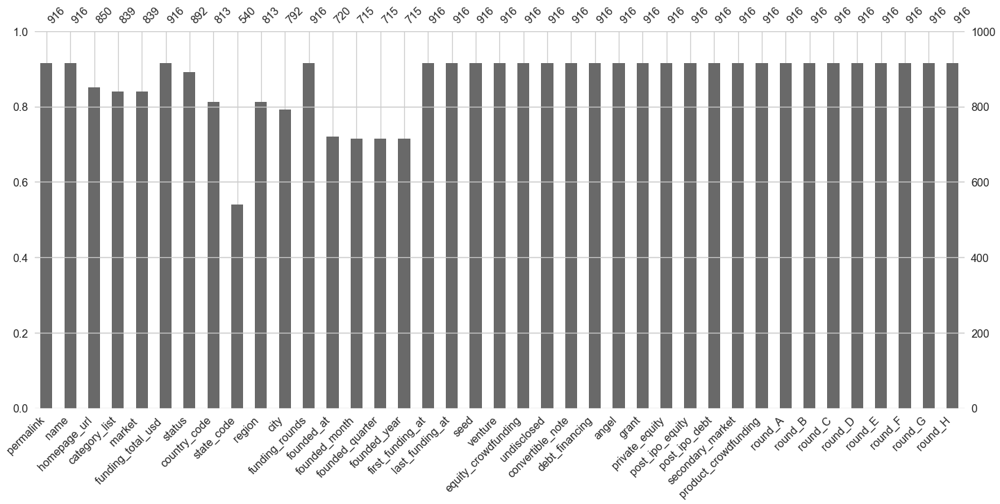


    A lot of seemingly linked nulls, dropping rows of one of those columns as they are likely null across the 
    columns


```python
df = df[df['name'].notna()]

missing_percent(df)
```

    permalink                0.000000
    undisclosed              0.000000
    convertible_note         0.000000
    debt_financing           0.000000
    angel                    0.000000
    grant                    0.000000
    private_equity           0.000000
    post_ipo_equity          0.000000
    equity_crowdfunding      0.000000
    post_ipo_debt            0.000000
    product_crowdfunding     0.000000
    round_A                  0.000000
    round_B                  0.000000
    round_C                  0.000000
    round_D                  0.000000
    round_E                  0.000000
    round_F                  0.000000
    secondary_market         0.000000
    round_G                  0.000000
    venture                  0.000000
    last_funding_at          0.000000
    name                     0.000000
     funding_total_usd       0.000000
    seed                     0.000000
    funding_rounds           0.000000
    round_H                  0.000000
    first_funding_at         0.000000
    status                   2.657928
    homepage_url             6.976556
    category_list            8.012218
     market                  8.026377
    region                  10.664078
    country_code            10.664078
    city                    12.369278
    founded_at              22.015899
    founded_month           22.161539
    founded_quarter         22.161539
    founded_year            22.161539
    state_code              38.991039
    dtype: float64


## Much better having some full bars!


```python
missing_bar()
```


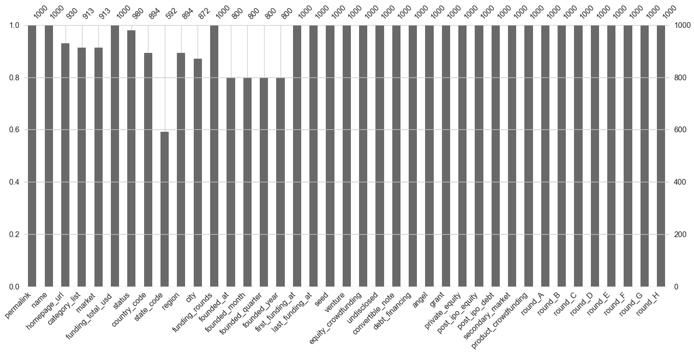


## Dropping 38% null state_code


```python
# Look into out of country / missing values
```


```python
df.drop('state_code', axis=1,inplace=True)

missing_bar()
```


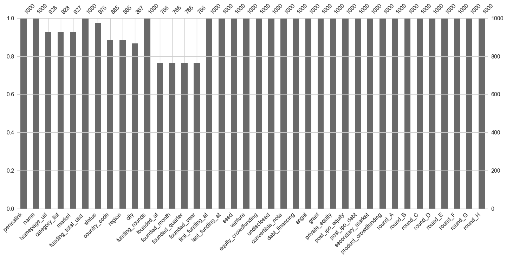


```python
df = df[df['founded_year'].notna()]

missing_bar()
```


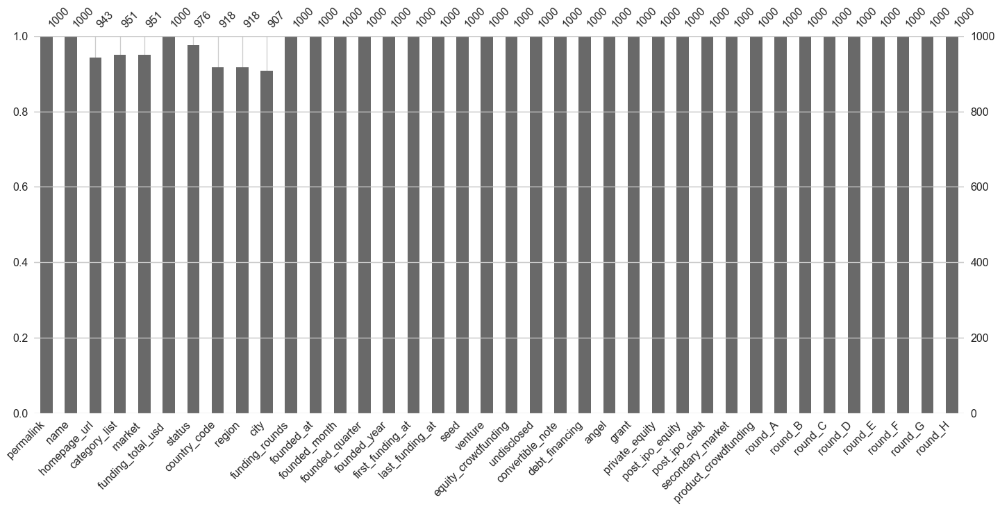


## Renaming these odd columns by stripping whitespace


```python
df.rename(columns=lambda x: x.strip(), inplace=True)
df.columns
```


    Index(['permalink', 'name', 'homepage_url', 'category_list', 'market',
           'funding_total_usd', 'status', 'country_code', 'region', 'city',
           'funding_rounds', 'founded_at', 'founded_month', 'founded_quarter',
           'founded_year', 'first_funding_at', 'last_funding_at', 'seed',
           'venture', 'equity_crowdfunding', 'undisclosed', 'convertible_note',
           'debt_financing', 'angel', 'grant', 'private_equity', 'post_ipo_equity',
           'post_ipo_debt', 'secondary_market', 'product_crowdfunding', 'round_A',
           'round_B', 'round_C', 'round_D', 'round_E', 'round_F', 'round_G',
           'round_H'],
          dtype='object')


## Dropping for lack of information


```python
df.drop(['permalink', 'homepage_url', 'name'], axis=1, inplace= True)

df.columns
```


    Index(['category_list', 'market', 'funding_total_usd', 'status',
           'country_code', 'region', 'city', 'funding_rounds', 'founded_at',
           'founded_month', 'founded_quarter', 'founded_year', 'first_funding_at',
           'last_funding_at', 'seed', 'venture', 'equity_crowdfunding',
           'undisclosed', 'convertible_note', 'debt_financing', 'angel', 'grant',
           'private_equity', 'post_ipo_equity', 'post_ipo_debt',
           'secondary_market', 'product_crowdfunding', 'round_A', 'round_B',
           'round_C', 'round_D', 'round_E', 'round_F', 'round_G', 'round_H'],
          dtype='object')


## Examining objects first as all the floats are non null

## Category_list seems to be an inflated version of market in that market takes the first value of category_list


```python
print(df.category_list.value_counts(dropna=False))
print(df.market.value_counts(dropna=False))
```

    |Software|                                                                            2880
    |Biotechnology|                                                                       2395
    NaN                                                                                   1977
    |E-Commerce|                                                                           946
    |Mobile|                                                                               897
                                                                                          ... 
    |Social Network Media|Opinions|Curated Web|                                              1
    |SaaS|CRM|Data Integration|Enterprise Software|                                          1
    |Sports|Entertainment|Games|                                                             1
    |Aerospace|Drones|Mobile|                                                                1
    |Advertising|Discounts|Marketplaces|SMS|App Marketing|Auto|Cars|Mobile|Automotive|       1
    Name: category_list, Length: 15059, dtype: int64
     Software                   3784
     Biotechnology              2463
    NaN                         1982
     Mobile                     1602
     E-Commerce                 1454
                                ... 
     Resorts                       1
     Local Commerce                1
     Distributed Generation        1
     Eyewear                       1
     Musicians                     1
    Name: market, Length: 736, dtype: int64


## Dropping inflated category_list


```python
df.drop('category_list',axis=1,inplace=True)
```

## Plotting out the top 10 markets


```python
ax = sns.countplot(y="market",data=df,
              order=df.market.value_counts().iloc[:10].index)
ax.set_ylabel("Market Type")
ax.set_xlabel("Companies")
ax.set_title("Companies by Market Type of Company")
```


    Text(0.5, 1.0, 'Companies by Market Type of Company')


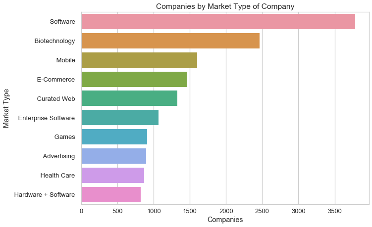


## Funding USD has commas and - as the most common value, these are issues, removing commas


```python
df['funding_total_usd'].value_counts(dropna=False)
```


     -               6347
     10,00,000        699
     1,00,000         611
     5,00,000         606
     20,00,000        476
                     ... 
     7,12,60,000        1
     2,87,00,000        1
     29,39,581          1
     3,67,740           1
     8,62,81,952        1
    Name: funding_total_usd, Length: 11919, dtype: int64


```python
df['funding_total_usd'] = df['funding_total_usd'].replace(',','', regex=True)
df['funding_total_usd'].value_counts(dropna=False)
```


     -             6347
     1000000        699
     100000         611
     500000         606
     2000000        476
                   ... 
     5062587          1
     156040191        1
     3911750          1
     91583            1
     14394888         1
    Name: funding_total_usd, Length: 11919, dtype: int64


## This will be our target variable: the status of a startup, we should drop the relatively few NaN 


```python
df.status.value_counts(dropna=False)
```


    operating    32597
    acquired      2971
    closed        1995
    NaN            918
    Name: status, dtype: int64


```python
df = df[df['status'].notna()]

df.info()
```

    <class 'pandas.core.frame.DataFrame'>
    Int64Index: 37563 entries, 0 to 49437
    Data columns (total 34 columns):
    market                  35762 non-null object
    funding_total_usd       37563 non-null object
    status                  37563 non-null object
    country_code            34627 non-null object
    region                  34627 non-null object
    city                    34206 non-null object
    funding_rounds          37563 non-null float64
    founded_at              37563 non-null object
    founded_month           37563 non-null object
    founded_quarter         37563 non-null object
    founded_year            37563 non-null float64
    first_funding_at        37563 non-null object
    last_funding_at         37563 non-null object
    seed                    37563 non-null float64
    venture                 37563 non-null float64
    equity_crowdfunding     37563 non-null float64
    undisclosed             37563 non-null float64
    convertible_note        37563 non-null float64
    debt_financing          37563 non-null float64
    angel                   37563 non-null float64
    grant                   37563 non-null float64
    private_equity          37563 non-null float64
    post_ipo_equity         37563 non-null float64
    post_ipo_debt           37563 non-null float64
    secondary_market        37563 non-null float64
    product_crowdfunding    37563 non-null float64
    round_A                 37563 non-null float64
    round_B                 37563 non-null float64
    round_C                 37563 non-null float64
    round_D                 37563 non-null float64
    round_E                 37563 non-null float64
    round_F                 37563 non-null float64
    round_G                 37563 non-null float64
    round_H                 37563 non-null float64
    dtypes: float64(23), object(11)
    memory usage: 10.0+ MB


## The majority are operating, leaving an imbalanced class challenge


```python
ax = sns.countplot(df['status'])

ax.set_ylabel('Amount of Companies in Status')
ax.set_xlabel('Status')
ax.set_title("Status of Companies")
```


    Text(0.5, 1.0, 'Status of Companies')


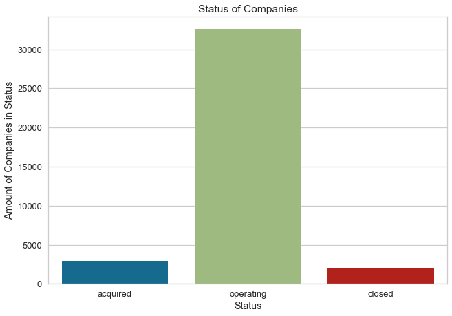


## A large amount of 0s in these columns


```python
print(df.round_A.value_counts())
print(df.angel.value_counts())
print(df.venture.value_counts())
print(df.equity_crowdfunding.value_counts())
print(df.undisclosed.value_counts())
```

    0.0           30259
    5000000.0       423
    2000000.0       312
    3000000.0       311
    4000000.0       271
                  ...  
    52500000.0        1
    4465448.0         1
    1016945.0         1
    558288.0          1
    17776000.0        1
    Name: round_A, Length: 1610, dtype: int64
    0.0          34761
    500000.0       174
    1000000.0      168
    100000.0       113
    250000.0       113
                 ...  
    282820.0         1
    2550000.0        1
    1175000.0        1
    47619.0          1
    97500.0          1
    Name: angel, Length: 903, dtype: int64
    0.0           20092
    5000000.0       346
    10000000.0      344
    2000000.0       315
    1000000.0       305
                  ...  
    48786221.0        1
    2787000.0         1
    89184501.0        1
    14294000.0        1
    9999999.0         1
    Name: venture, Length: 7264, dtype: int64
    0.0          37079
    100000.0        21
    50000.0         19
    1000.0          16
    10000.0         14
                 ...  
    1247816.0        1
    221480.0         1
    94311.0          1
    21000.0          1
    220000.0         1
    Name: equity_crowdfunding, Length: 224, dtype: int64
    0.0          36944
    100000.0        16
    500000.0        15
    1000000.0       13
    300000.0        12
                 ...  
    550000.0         1
    2400000.0        1
    2000.0           1
    445035.0         1
    4714510.0        1
    Name: undisclosed, Length: 444, dtype: int64


## Geo vars starting with country code - to be encoded and then sparse values dropped


```python
print(df['country_code'].value_counts().nlargest(20))
print(df['region'].value_counts().nlargest(20))
print(df['city'].value_counts().nlargest(20))
```

    USA    23182
    GBR     1968
    CAN     1074
    DEU      722
    FRA      669
    IND      667
    CHN      653
    ISR      591
    ESP      422
    IRL      258
    SGP      248
    AUS      243
    KOR      232
    NLD      230
    SWE      228
    ITA      223
    BRA      218
    JPN      206
    CHL      176
    RUS      176
    Name: country_code, dtype: int64
    SF Bay Area         5693
    New York City       2210
    Boston              1455
    London              1276
    Los Angeles         1142
    Seattle              757
    Washington, D.C.     633
    Chicago              616
    Austin               515
    San Diego            512
    Denver               509
    Tel Aviv             453
    Atlanta              424
    Paris                405
    Toronto              400
    Newark               366
    Dallas               349
    Philadelphia         304
    Berlin               297
    Salt Lake City       286
    Name: region, dtype: int64
    San Francisco    2245
    New York         2000
    London           1043
    Palo Alto         493
    Austin            486
    Seattle           460
    Chicago           440
    Cambridge         433
    Mountain View     419
    Los Angeles       418
    Boston            375
    San Diego         357
    Paris             357
    Sunnyvale         301
    San Jose          300
    Berlin            288
    Toronto           284
    Beijing           275
    Atlanta           274
    Santa Clara       254
    Name: city, dtype: int64


## Dropping city due to redundant data with region


```python
#Which one has more granular/useful information?
```


```python
df.drop('city',axis=1,inplace=True)
```

## Datetime variables


```python
df['founded_quarter'].value_counts(dropna=False)
```


    2012-Q1    2802
    2011-Q1    2684
    2010-Q1    2212
    2013-Q1    2146
    2009-Q1    1799
               ... 
    1973-Q3       1
    1979-Q2       1
    1908-Q1       1
    1963-Q3       1
    1960-Q2       1
    Name: founded_quarter, Length: 218, dtype: int64


```python
df['founded_quarter'] = df['founded_quarter'].str.split('-Q').str[1]

df['founded_quarter'].value_counts(dropna=False)
```


    1    24877
    2     4664
    3     4237
    4     3785
    Name: founded_quarter, dtype: int64


## Resampling datetime to year, only keeping founded_at of year and quarter, keeping first and last funding


```python
dt_cols = ['founded_at', 'first_funding_at', 'last_funding_at']

df = df.drop(['founded_month', 'founded_year'],axis=1)
```


```python
df[dt_cols] = df[dt_cols].apply(pd.to_datetime, errors='coerce')

df.info()
```

    <class 'pandas.core.frame.DataFrame'>
    Int64Index: 37563 entries, 0 to 49437
    Data columns (total 31 columns):
    market                  35762 non-null object
    funding_total_usd       37563 non-null object
    status                  37563 non-null object
    country_code            34627 non-null object
    region                  34627 non-null object
    funding_rounds          37563 non-null float64
    founded_at              37563 non-null datetime64[ns]
    founded_quarter         37563 non-null object
    first_funding_at        37557 non-null datetime64[ns]
    last_funding_at         37561 non-null datetime64[ns]
    seed                    37563 non-null float64
    venture                 37563 non-null float64
    equity_crowdfunding     37563 non-null float64
    undisclosed             37563 non-null float64
    convertible_note        37563 non-null float64
    debt_financing          37563 non-null float64
    angel                   37563 non-null float64
    grant                   37563 non-null float64
    private_equity          37563 non-null float64
    post_ipo_equity         37563 non-null float64
    post_ipo_debt           37563 non-null float64
    secondary_market        37563 non-null float64
    product_crowdfunding    37563 non-null float64
    round_A                 37563 non-null float64
    round_B                 37563 non-null float64
    round_C                 37563 non-null float64
    round_D                 37563 non-null float64
    round_E                 37563 non-null float64
    round_F                 37563 non-null float64
    round_G                 37563 non-null float64
    round_H                 37563 non-null float64
    dtypes: datetime64[ns](3), float64(22), object(6)
    memory usage: 10.4+ MB


## 1962 is a very early year...going to remove early years when preprocessing datetimes


```python
print(df.founded_at.value_counts())
print(df.first_funding_at.value_counts())
print(df.last_funding_at.value_counts())
```

    2012-01-01    2100
    2011-01-01    2096
    2010-01-01    1810
    2009-01-01    1561
    2013-01-01    1535
                  ... 
    2004-10-31       1
    2005-07-19       1
    2012-10-04       1
    1962-01-01       1
    2003-12-10       1
    Name: founded_at, Length: 3299, dtype: int64
    2012-01-01    376
    2013-01-01    359
    2008-01-01    347
    2011-01-01    336
    2007-01-01    294
                 ... 
    2005-05-14      1
    2008-01-24      1
    2006-08-06      1
    2009-08-20      1
    2005-05-24      1
    Name: first_funding_at, Length: 3685, dtype: int64
    2013-01-01    291
    2012-01-01    262
    2014-01-01    252
    2008-01-01    237
    2011-01-01    227
                 ... 
    1995-07-01      1
    1995-11-30      1
    2004-04-05      1
    2001-03-13      1
    1999-03-30      1
    Name: last_funding_at, Length: 3394, dtype: int64


## Extracting just the year for easier encoding


```python
df['founded_at'] = df.founded_at.dt.year
df.first_funding_at = df.first_funding_at.dt.year
df.last_funding_at = df.last_funding_at.dt.year
```


```python
df.founded_at.value_counts().sort_index()[:10]
```


    1902    2
    1903    1
    1905    1
    1906    5
    1907    1
    1908    1
    1910    2
    1911    2
    1912    6
    1913    2
    Name: founded_at, dtype: int64


## Clearly there are some too early years here

## Picking 1999 as start date as that's when the numbers begin to jump leading up to Y2K


```python
df = df[df['founded_at'] > 1998]  
df = df[df['first_funding_at'] > 1998]
df = df[df['last_funding_at'] > 1998]
print(df.founded_at.value_counts())
print(df.first_funding_at.value_counts())
print(df.last_funding_at.value_counts())
```

    2012    5036
    2011    4773
    2013    3956
    2010    3694
    2009    2906
    2008    2303
    2007    2290
    2006    1770
    2014    1458
    2005    1393
    2004    1132
    2003     940
    2000     877
    2002     774
    1999     736
    2001     726
    Name: founded_at, dtype: int64
    2013.0    6944
    2014.0    5571
    2012.0    5249
    2011.0    4381
    2010.0    3496
    2009.0    2684
    2008.0    1891
    2007.0    1689
    2006.0    1312
    2005.0     945
    2004.0     197
    2003.0     124
    2000.0      92
    2002.0      68
    2001.0      66
    1999.0      55
    Name: first_funding_at, dtype: int64
    2014.0    10251
    2013.0     8229
    2012.0     4688
    2011.0     3556
    2010.0     2593
    2009.0     1780
    2008.0     1372
    2007.0     1067
    2006.0      611
    2005.0      372
    2004.0       74
    2003.0       51
    2000.0       48
    2001.0       32
    2002.0       22
    1999.0       17
    2015.0        1
    Name: last_funding_at, dtype: int64


## Creating new features:
    These features focus around the difference between funding at different times, as well as the years a startup has operated.


```python
df['funding_diff'] = (df['last_funding_at'] - df['first_funding_at'])
df['years_operating'] = (2014 - df['founded_at'])
df = df.drop('founded_at',axis=1)
print(df['funding_diff'])
print(df['years_operating'].value_counts())
```

    0        0.0
    2        0.0
    3        0.0
    4        0.0
    7        0.0
            ... 
    49428    2.0
    49432    0.0
    49433    0.0
    49435    3.0
    49437    5.0
    Name: funding_diff, Length: 34764, dtype: float64
    2     5036
    3     4773
    1     3956
    4     3694
    5     2906
    6     2303
    7     2290
    8     1770
    0     1458
    9     1393
    10    1132
    11     940
    14     877
    12     774
    15     736
    13     726
    Name: years_operating, dtype: int64


```python
ax = sns.distplot(df['years_operating'],hist=True, kde=False)

ax.set_ylabel('Amount of Companies')
ax.set_xlabel('Years in Operation')
ax.set_title("Duration of Company Operation")
```


    Text(0.5, 1.0, 'Duration of Company Operation')


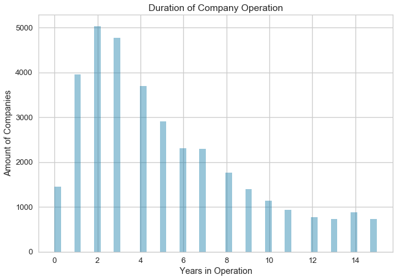


## Creating dummies of first funding and last funding


```python
date_cols = ['first_funding_at', 'last_funding_at']
df = pd.concat([df, pd.get_dummies(df[date_cols].astype(str))], axis=1)
df = df.drop(date_cols,axis=1)
df.columns
```


    Index(['market', 'funding_total_usd', 'status', 'country_code', 'region',
           'funding_rounds', 'founded_quarter', 'seed', 'venture',
           'equity_crowdfunding', 'undisclosed', 'convertible_note',
           'debt_financing', 'angel', 'grant', 'private_equity', 'post_ipo_equity',
           'post_ipo_debt', 'secondary_market', 'product_crowdfunding', 'round_A',
           'round_B', 'round_C', 'round_D', 'round_E', 'round_F', 'round_G',
           'round_H', 'funding_diff', 'years_operating', 'first_funding_at_1999.0',
           'first_funding_at_2000.0', 'first_funding_at_2001.0',
           'first_funding_at_2002.0', 'first_funding_at_2003.0',
           'first_funding_at_2004.0', 'first_funding_at_2005.0',
           'first_funding_at_2006.0', 'first_funding_at_2007.0',
           'first_funding_at_2008.0', 'first_funding_at_2009.0',
           'first_funding_at_2010.0', 'first_funding_at_2011.0',
           'first_funding_at_2012.0', 'first_funding_at_2013.0',
           'first_funding_at_2014.0', 'last_funding_at_1999.0',
           'last_funding_at_2000.0', 'last_funding_at_2001.0',
           'last_funding_at_2002.0', 'last_funding_at_2003.0',
           'last_funding_at_2004.0', 'last_funding_at_2005.0',
           'last_funding_at_2006.0', 'last_funding_at_2007.0',
           'last_funding_at_2008.0', 'last_funding_at_2009.0',
           'last_funding_at_2010.0', 'last_funding_at_2011.0',
           'last_funding_at_2012.0', 'last_funding_at_2013.0',
           'last_funding_at_2014.0', 'last_funding_at_2015.0'],
          dtype='object')


## Encoding market, region and country


```python
df = pd.concat([df, pd.get_dummies(df['market'])], axis=1)
df.drop('market',axis=1,inplace=True)
df = pd.concat([df, pd.get_dummies(df['country_code'])], axis=1)
df.drop('country_code',axis=1,inplace=True)
df = pd.concat([df, pd.get_dummies(df['region'])], axis=1)
df.drop('region',axis=1,inplace=True)

df.columns
```


    Index(['funding_total_usd', 'status', 'funding_rounds', 'founded_quarter',
           'seed', 'venture', 'equity_crowdfunding', 'undisclosed',
           'convertible_note', 'debt_financing',
           ...
           'Yverdon-les-bains', 'ZAF - Other', 'Zafirovo', 'Zagreb',
           'Zanzibar Urban', 'Zaragoza', 'Zhengzhou', 'Zurich', 'Çan', 'Évry'],
          dtype='object', length=1870)


```python
missing_percent(df)
```

    funding_total_usd                0.0
    Hangzhou                         0.0
    Hampshire                        0.0
    Hamilton                         0.0
    Hamburg                          0.0
                                    ... 
     Robotics                        0.0
     Risk Management                 0.0
     Reviews and Recommendations     0.0
     Security                        0.0
    Évry                             0.0
    Length: 1870, dtype: float64


## Dropping over 99% 0s - is this good practice? Do the 0s contain info?


```python
df = df.loc[:, df.eq(0).mean().le(.99)]

len(df.columns)
```


    82


```python
missing_bar()
```


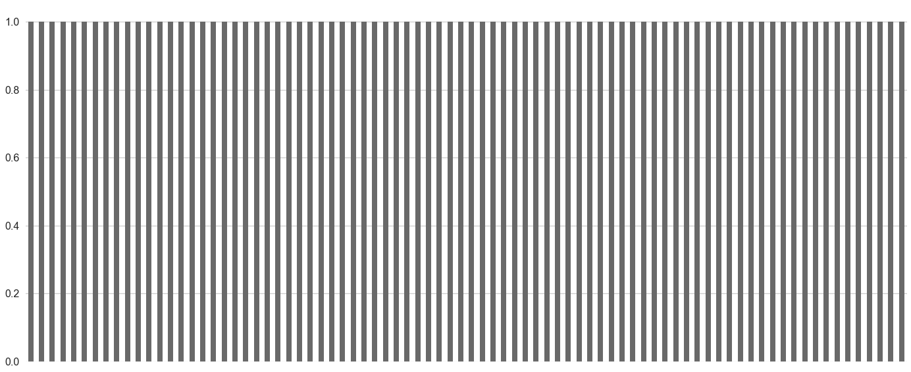


## Total funding: Gotta impute those - first before train test split!!! - imputing as 0 


```python

df['funding_total_usd'].replace(' -   ',0, inplace=True)

df['funding_total_usd'].value_counts(dropna=False)
```


    0             5703
     1000000       640
     100000        583
     500000        578
     40000         466
                  ... 
     1277238         1
     370561          1
     13250001        1
     26027500        1
     10510000        1
    Name: funding_total_usd, Length: 10820, dtype: int64


```python
df['funding_total_usd']= df['funding_total_usd'].str.strip()

df.funding_total_usd.value_counts(dropna=False)
```


    NaN         5703
    1000000      640
    100000       583
    500000       578
    40000        466
                ... 
    15391438       1
    34999992       1
    2492429        1
    1384222        1
    45728926       1
    Name: funding_total_usd, Length: 10820, dtype: int64


```python
df['funding_total_usd']= df['funding_total_usd'].fillna(0)

df.funding_total_usd.value_counts(dropna=False)
```


    0           5703
    1000000      640
    100000       583
    500000       578
    40000        466
                ... 
    34999992       1
    2492429        1
    1384222        1
    9950000        1
    2097106        1
    Name: funding_total_usd, Length: 10820, dtype: int64


```python
len(df)
```


    34764


```python
df['funding_total_usd'] = df['funding_total_usd'].astype(int)
```


```python
df['per_round'] = df['funding_total_usd'] / df['funding_rounds']
```

## These two are early funding rounds, A and seed


```python
#These two are early funding rounds
df['funding_minus_A'] = df['funding_total_usd'] - df['round_A']
df['funding_minus_seed'] = df['funding_total_usd'] - df['seed']

df['funding_plus_seed'] = df['funding_total_usd'] + df['seed']
```


```python
df.columns
```


    Index(['funding_total_usd', 'status', 'funding_rounds', 'founded_quarter',
           'seed', 'venture', 'equity_crowdfunding', 'undisclosed',
           'convertible_note', 'debt_financing', 'angel', 'grant',
           'private_equity', 'round_A', 'round_B', 'round_C', 'round_D', 'round_E',
           'funding_diff', 'years_operating', 'first_funding_at_2005.0',
           'first_funding_at_2006.0', 'first_funding_at_2007.0',
           'first_funding_at_2008.0', 'first_funding_at_2009.0',
           'first_funding_at_2010.0', 'first_funding_at_2011.0',
           'first_funding_at_2012.0', 'first_funding_at_2013.0',
           'first_funding_at_2014.0', 'last_funding_at_2005.0',
           'last_funding_at_2006.0', 'last_funding_at_2007.0',
           'last_funding_at_2008.0', 'last_funding_at_2009.0',
           'last_funding_at_2010.0', 'last_funding_at_2011.0',
           'last_funding_at_2012.0', 'last_funding_at_2013.0',
           'last_funding_at_2014.0', ' Advertising ', ' Analytics ',
           ' Biotechnology ', ' Clean Technology ', ' Curated Web ',
           ' E-Commerce ', ' Education ', ' Enterprise Software ', ' Finance ',
           ' Games ', ' Hardware + Software ', ' Health Care ',
           ' Health and Wellness ', ' Manufacturing ', ' Mobile ', ' Security ',
           ' Social Media ', ' Software ', 'CAN', 'CHN', 'DEU', 'ESP', 'FRA',
           'GBR', 'IND', 'ISR', 'USA', 'Atlanta', 'Austin', 'Boston', 'Chicago',
           'Denver', 'London', 'Los Angeles', 'New York City', 'Paris',
           'SF Bay Area', 'San Diego', 'Seattle', 'Tel Aviv', 'Toronto',
           'Washington, D.C.', 'per_round', 'funding_minus_A',
           'funding_minus_seed', 'funding_plus_seed'],
          dtype='object')


## Encoding target variable


```python
df = df.replace({'status':{'closed':0,'acquired':1,'operating':0}})
```

# Modeling:  
    Models: 
    - Decision Trees(balanced & not), 
    - Random Forests(balanced & not), 
    - AdaBoost, 
    - XGBoost

## Setting X and Y


```python
X = df.drop('status',axis=1)
y = df['status']
```


```python
y
```


    0        1
    2        0
    3        0
    4        0
    7        0
            ..
    49428    0
    49432    0
    49433    0
    49435    0
    49437    0
    Name: status, Length: 34764, dtype: int64


## Train test split, stratified on y to compensate for class balance 
- Some information on stratification on test_train split goes here (https://machinelearningmastery.com/cross-validation-for-imbalanced-classification/ )


```python

X_train, X_test, y_train, y_test = train_test_split(X, y, random_state=42, stratify=y)
```

## Minmax scaling X split


```python
scaler = MinMaxScaler()
X_train = scaler.fit_transform(X_train)
X_test = scaler.transform(X_test)

```

## The problem: Class Balance


```python
visualizer = ClassBalance(labels=[0, 1])

visualizer.fit(y_train,y_test)
visualizer.ax.set_xlabel("Classes")
visualizer.ax.set_ylabel("Amount of Occurrences of Class")
visualizer.show()
```


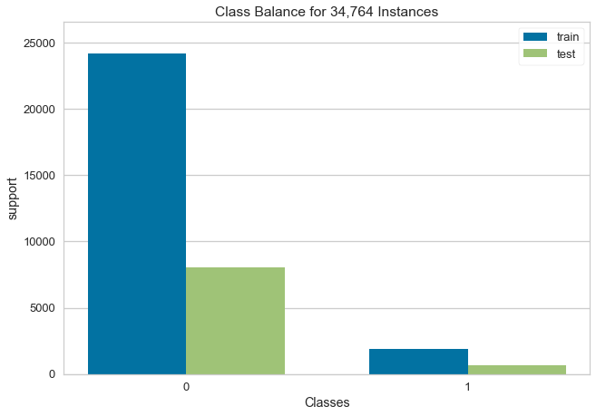


    <matplotlib.axes._subplots.AxesSubplot at 0x1c21d2c240>


## First model - decision tree with default parameters


```python
def classify(clf, X_train=X_train, y_train=y_train, X_test=X_test, y_test=y_test):
    '''Passed a classifier and appropriate test-train split, displays a classification report, class prediction error, 
    and several metrics- f1 weighted, micro, macro and Cohen kappa- to show results. '''
    clf.fit(X_train, y_train)
    y_pred = clf.predict(X_test)
    fig = plt.figure(linewidth=10, edgecolor="#04253a")
    clf_rep = ClassificationReport(clf, classes=[0,1], support=True)
    clf_rep.fit(X_train, y_train)
    clf_rep.score(X_test, y_test)      
    clf_rep.show() 
    
    from yellowbrick.classifier import ClassPredictionError
    fig = plt.figure(linewidth=10, edgecolor="#04253a")
    pred_error = ClassPredictionError(clf, classes=[0,1])
    pred_error.fit(X_train, y_train)
    pred_error.score(X_test, y_test)

    pred_error.show()
    print(f"^^^ Classification Report for {clf.__class__.__name__} ^^^")
    print(f"F1 weighted score is {f1_score(y_test, y_pred, average='weighted')}")    
    print(f"F1 micro score is {f1_score(y_test, y_pred, average='micro')}")      
    print(f"F1 macro score is {f1_score(y_test, y_pred, average='macro')}")
    print(f"Cohen kappa score is {cohen_kappa_score(y_test, y_pred)}") 
    plt.tight_layout()
```


```python
def classify_multiple(clfs, X_tr=X_train, y_tr=y_train, X_te=X_test, y_te=y_test, kind=None):
    '''When passed multiple classifiers and a test-train split, runs classify() to run each together. Optional
    kind parameter helps to print out what sort of classifiers are being used.'''
    if kind == "balanced":
        print("Balanced Classifiers Report")
    elif kind == "boost":
        print("Boosting Classifiers Report")
    else:
        print("Base Classifiers Report")

    for clf in clfs:
        classify(clf,X_train=X_tr, y_train=y_tr, X_test=X_te, y_test=y_te)
```


```python
from xgboost import XGBClassifier
from sklearn.svm import SVC

#naive, simple tree based models
classifiers=[ 
    DecisionTreeClassifier(random_state=0),
                          RandomForestClassifier(random_state=0),
]

#classifiers using class_weight = 'balanced'
balanced_classifiers=[
DecisionTreeClassifier(random_state=0, class_weight='balanced'),
RandomForestClassifier(random_state=0, class_weight='balanced')]

#boosted trees
boost_clf=[
    GridSearchCV(AdaBoostClassifier(random_state=0), scoring='f1_macro', param_grid={
        'n_estimators': [100,200],
        'learning_rate': [0.001,0.01,0.1,0.2,0.5]
    }),
    XGBClassifier(random_state=0)
]
```


```python
classify_multiple(classifiers)
```

    Base Classifiers Report


    ^^^ Classification Report for DecisionTreeClassifier ^^^
    F1 weighted score is 0.8879973628399125
    F1 micro score is 0.8881601656886434
    F1 macro score is 0.5859573777318234
    Cohen kappa score is 0.17191540485084644


    <Figure size 748.8x514.8 with 0 Axes>


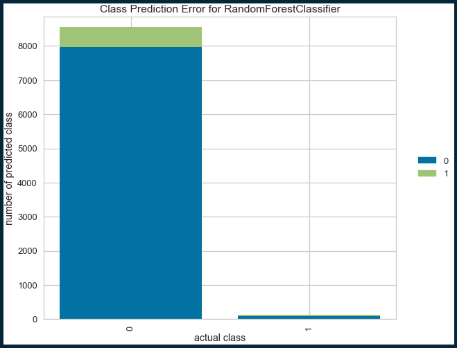


    ^^^ Classification Report for RandomForestClassifier ^^^
    F1 weighted score is 0.8988282990489012
    F1 micro score is 0.9225635715107583
    F1 macro score is 0.544422953094291
    Cohen kappa score is 0.10604499576104309


    <Figure size 748.8x514.8 with 0 Axes>


```python
classify_multiple(balanced_classifiers, kind="balanced")
```

    Balanced Classifiers Report


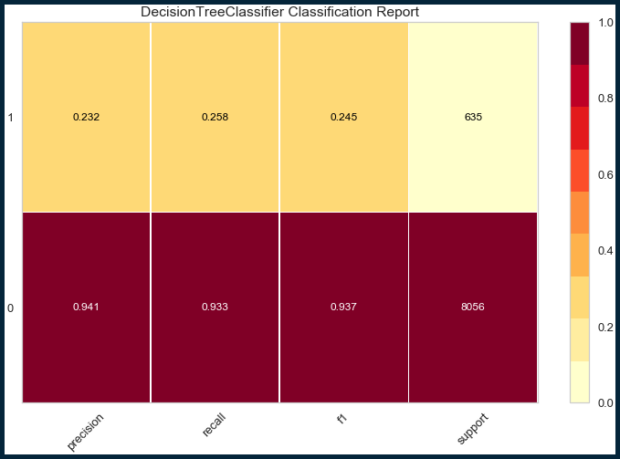


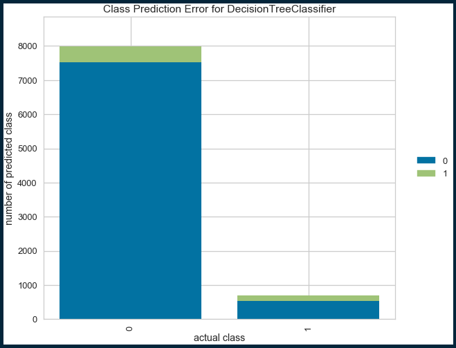


    ^^^ Classification Report for DecisionTreeClassifier ^^^
    F1 weighted score is 0.8862702886496393
    F1 micro score is 0.8834426418133703
    F1 macro score is 0.59072145524186
    Cohen kappa score is 0.18163469065053006


    <Figure size 748.8x514.8 with 0 Axes>


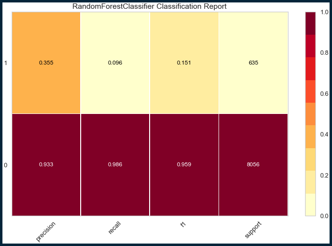


    ^^^ Classification Report for RandomForestClassifier ^^^
    F1 weighted score is 0.8996737765125038
    F1 micro score is 0.9211828328155564
    F1 macro score is 0.5549249496767537
    Cohen kappa score is 0.12389074224043828


    <Figure size 748.8x514.8 with 0 Axes>


```python
classify_multiple(boost_clf,kind="boost")
```

    Boosting Classifiers Report


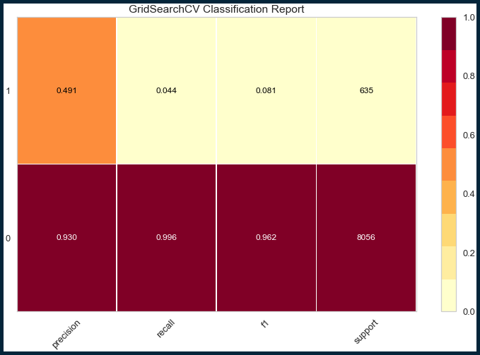


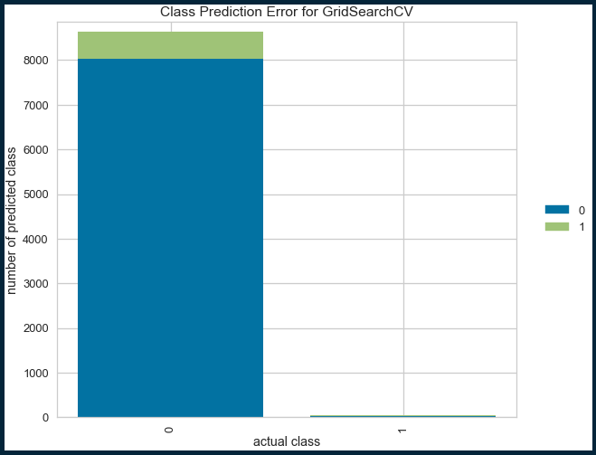


    ^^^ Classification Report for GridSearchCV ^^^
    F1 weighted score is 0.8975261886188154
    F1 micro score is 0.9268208491542975
    F1 macro score is 0.521409102401147
    Cohen kappa score is 0.06972756657851131


    <Figure size 748.8x514.8 with 0 Axes>


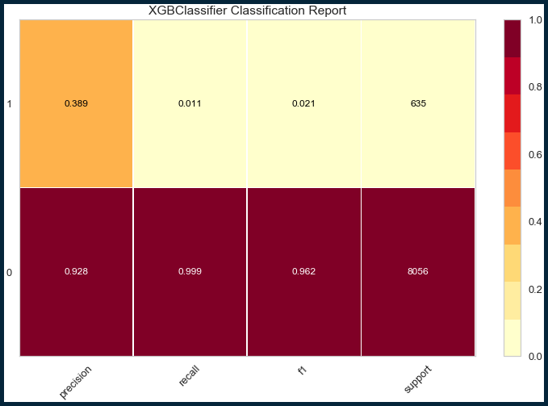


    ^^^ Classification Report for XGBClassifier ^^^
    F1 weighted score is 0.8930960657392205
    F1 micro score is 0.9264756644804971
    F1 macro score is 0.49162118363385254
    Cohen kappa score is 0.01748189208654871


    <Figure size 748.8x514.8 with 0 Axes>


# Sampling:

## SMOTE


```python
print('Original class distribution: \n')
print(y.value_counts())
smote = SMOTE(random_state=0)
X_train_re, y_train_re = smote.fit_resample(X_train, y_train) 
print('-----------------------------------------')
print('Synthetic sample class distribution: \n')
print(pd.Series(y_train_re).value_counts()) 
```

    Original class distribution: 
    
    0    32222
    1     2542
    Name: status, dtype: int64
    -----------------------------------------
    Synthetic sample class distribution: 
    
    1    24166
    0    24166
    dtype: int64


```python
classify_multiple(classifiers,X_tr=X_train_re, X_te=X_test, y_tr=y_train_re, y_te=y_test)
```

    Base Classifiers Report


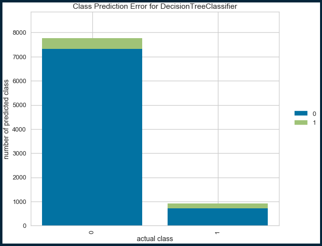


    ^^^ Classification Report for DecisionTreeClassifier ^^^
    F1 weighted score is 0.8778331617860842
    F1 micro score is 0.8665285927971464
    F1 macro score is 0.5924889221027293
    Cohen kappa score is 0.1878155086154768


    <Figure size 748.8x514.8 with 0 Axes>


    ^^^ Classification Report for RandomForestClassifier ^^^
    F1 weighted score is 0.8935682250494272
    F1 micro score is 0.8916120124266482
    F1 macro score is 0.6143941120947732
    Cohen kappa score is 0.22888643245387685


    <Figure size 748.8x514.8 with 0 Axes>


```python
classify_multiple(boost_clf,X_tr=X_train_re, X_te=X_test, y_tr=y_train_re, y_te=y_test, kind="boost")
```

    Boosting Classifiers Report


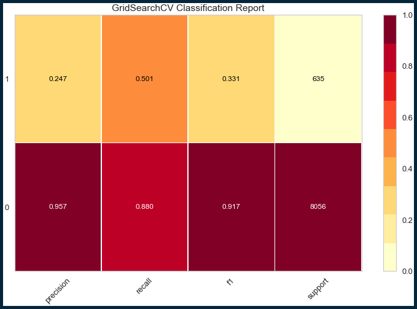


    ^^^ Classification Report for GridSearchCV ^^^
    F1 weighted score is 0.8741635028645058
    F1 micro score is 0.8522609596133932
    F1 macro score is 0.6241038513775707
    Cohen kappa score is 0.25875692554585694


    <Figure size 748.8x514.8 with 0 Axes>


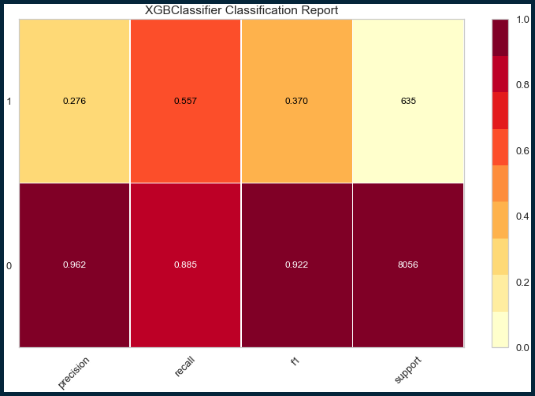


    ^^^ Classification Report for XGBClassifier ^^^
    F1 weighted score is 0.8815345291355678
    F1 micro score is 0.8610056380163389
    F1 macro score is 0.645706509018233
    Cohen kappa score is 0.30125338384086453


    <Figure size 748.8x514.8 with 0 Axes>


## SMOTomek


```python
from imblearn.combine import SMOTETomek

print('Original class distribution: \n')
print(y.value_counts())
smoteo = SMOTETomek(random_state=0)
X_train_st, y_train_st = smoteo.fit_resample(X_train, y_train) 
print('-----------------------------------------')
print('Synthetic sample class distribution: \n')
print(pd.Series(y_train_st).value_counts()) 
```

    Original class distribution: 
    
    0    32222
    1     2542
    Name: status, dtype: int64
    -----------------------------------------
    Synthetic sample class distribution: 
    
    1    23880
    0    23880
    dtype: int64


```python
classify_multiple(classifiers,X_tr=X_train_st, X_te=X_test, y_tr=y_train_st, y_te=y_test)
```

    Base Classifiers Report


    ^^^ Classification Report for DecisionTreeClassifier ^^^
    F1 weighted score is 0.8805100896918161
    F1 micro score is 0.8704406857668853
    F1 macro score is 0.5974606710292762
    Cohen kappa score is 0.19722280009686421


    <Figure size 748.8x514.8 with 0 Axes>


    ^^^ Classification Report for RandomForestClassifier ^^^
    F1 weighted score is 0.8920689812337629
    F1 micro score is 0.8903463352893798
    F1 macro score is 0.6079855244945063
    Cohen kappa score is 0.21604618618058669


    <Figure size 748.8x514.8 with 0 Axes>


```python
classify_multiple(boost_clf,X_tr=X_train_st, X_te=X_test, y_tr=y_train_st, y_te=y_test, kind="boost")
```

    Boosting Classifiers Report


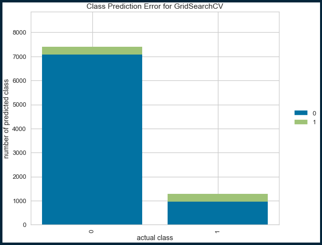


    ^^^ Classification Report for GridSearchCV ^^^
    F1 weighted score is 0.8744816546129737
    F1 micro score is 0.8524910827292601
    F1 macro score is 0.6257133101784667
    Cohen kappa score is 0.2620939413334237


    <Figure size 748.8x514.8 with 0 Axes>


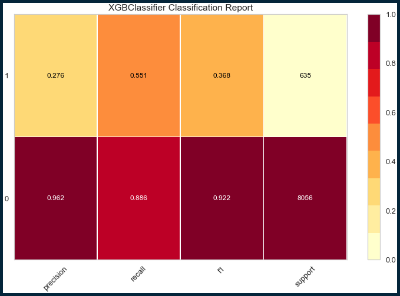


    ^^^ Classification Report for XGBClassifier ^^^
    F1 weighted score is 0.8819293681587794
    F1 micro score is 0.8618110689218732
    F1 macro score is 0.6453241405247362
    Cohen kappa score is 0.3001172540466124


    <Figure size 748.8x514.8 with 0 Axes>


## ADASYN


```python
from imblearn.over_sampling import ADASYN

print('Original class distribution: \n')
print(y.value_counts())
ada = ADASYN(random_state=0)
X_train_ada, y_train_ada = ada.fit_resample(X_train, y_train) 
print('-----------------------------------------')
print('Synthetic sample class distribution: \n')
print(pd.Series(y_train_ada).value_counts()) 
```

    Original class distribution: 
    
    0    32222
    1     2542
    Name: status, dtype: int64
    -----------------------------------------
    Synthetic sample class distribution: 
    
    0    24166
    1    24140
    dtype: int64


```python
classify_multiple(boost_clf,X_tr=X_train_ada, X_te=X_test, y_tr=y_train_ada, y_te=y_test, kind="boost")
```

    Boosting Classifiers Report


    ^^^ Classification Report for GridSearchCV ^^^
    F1 weighted score is 0.8695611408759941
    F1 micro score is 0.8451271430215165
    F1 macro score is 0.6184188997706225
    Cohen kappa score is 0.24959750676787773


    <Figure size 748.8x514.8 with 0 Axes>


    ^^^ Classification Report for XGBClassifier ^^^
    F1 weighted score is 0.879689144788162
    F1 micro score is 0.8584742837418019
    F1 macro score is 0.6418711933908219
    Cohen kappa score is 0.29410620383678576


    <Figure size 748.8x514.8 with 0 Axes>


## SMOTEENN


```python
from imblearn.combine import SMOTEENN

print('Original class distribution: \n')
print(y.value_counts())
smoteenn = SMOTEENN(random_state=0)
X_train_nn, y_train_nn = smoteenn.fit_resample(X_train, y_train) 
print('-----------------------------------------')
print('Synthetic sample class distribution: \n')
print(pd.Series(y_train_nn).value_counts()) 
```

    Original class distribution: 
    
    0    32222
    1     2542
    Name: status, dtype: int64
    -----------------------------------------
    Synthetic sample class distribution: 
    
    1    21336
    0    19736
    dtype: int64


```python
classify_multiple(classifiers,X_tr=X_train_nn, X_te=X_test, y_tr=y_train_nn, y_te=y_test)
```

    Base Classifiers Report


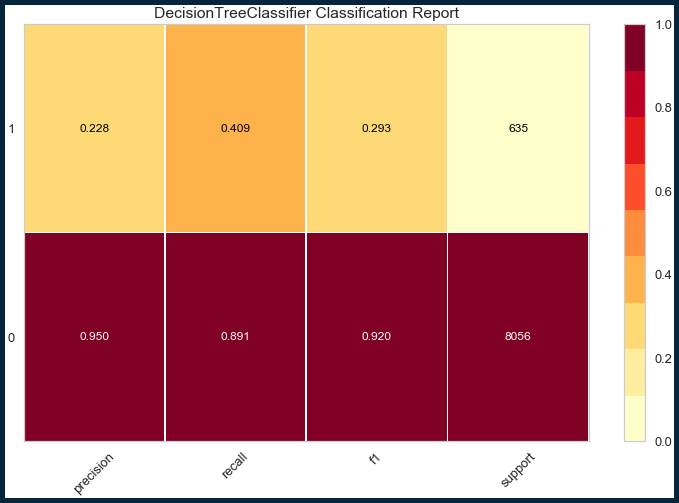


    ^^^ Classification Report for DecisionTreeClassifier ^^^
    F1 weighted score is 0.8739557074177698
    F1 micro score is 0.8558278679093315
    F1 macro score is 0.6065070056441688
    Cohen kappa score is 0.2201436376973368


    <Figure size 748.8x514.8 with 0 Axes>


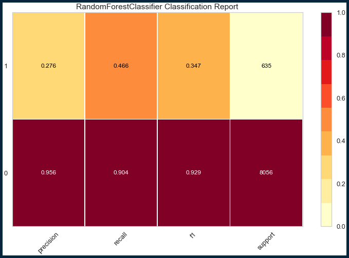


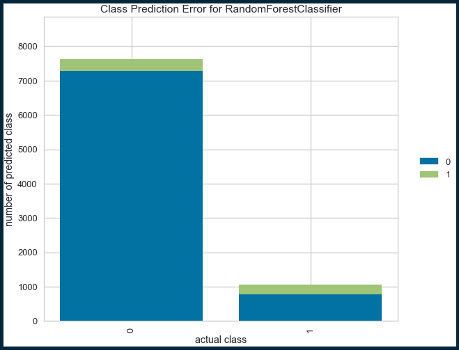


    ^^^ Classification Report for RandomForestClassifier ^^^
    F1 weighted score is 0.8863399135345206
    F1 micro score is 0.8717063629041537
    F1 macro score is 0.6378374439053378
    Cohen kappa score is 0.28080783446935254


    <Figure size 748.8x514.8 with 0 Axes>


# Conclusion:

# Suggested Model:

## Gridsearched boosting models


```python
classify_multiple(boost_clf,X_tr=X_train_nn, X_te=X_test, y_tr=y_train_nn, y_te=y_test, kind="boost")
```

    Boosting Classifiers Report


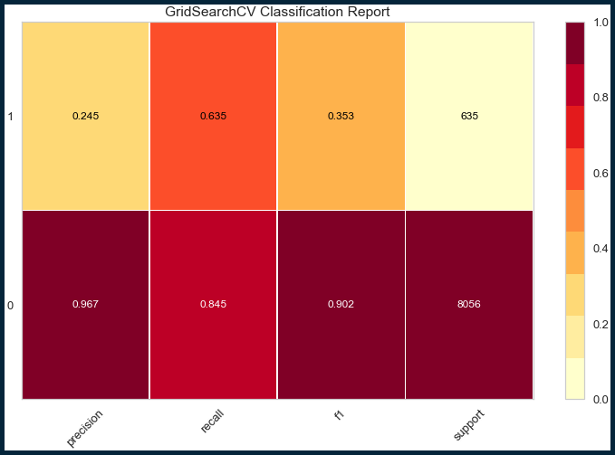


    ^^^ Classification Report for GridSearchCV ^^^
    F1 weighted score is 0.8620569246043164
    F1 micro score is 0.8300540789322287
    F1 macro score is 0.6276115961417674
    Cohen kappa score is 0.27675354322452494


    <Figure size 748.8x514.8 with 0 Axes>


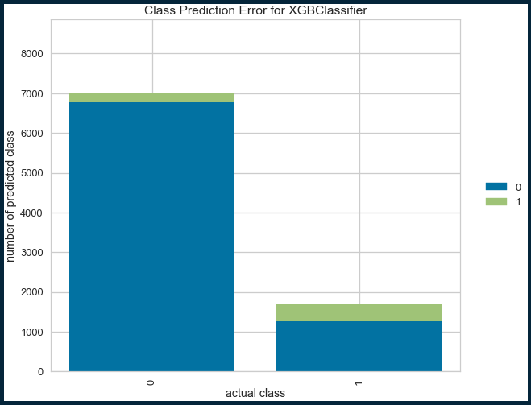


    ^^^ Classification Report for XGBClassifier ^^^
    F1 weighted score is 0.8610347752885869
    F1 micro score is 0.8280980324473594
    F1 macro score is 0.6286929800179129
    Cohen kappa score is 0.28016712706477853


    <Figure size 748.8x514.8 with 0 Axes>


# Final Model: XGBClassifier


```python
f_mod = XGBClassifier(random_state=0)
f_mod.fit(X_train_nn, y_train_nn)

f_mod.feature_importances_
```


    array([0.00171505, 0.01059255, 0.03004722, 0.01540748, 0.0462784 ,
           0.        , 0.        , 0.00222155, 0.00474793, 0.00827753,
           0.00479081, 0.        , 0.07625017, 0.0663092 , 0.01872329,
           0.00401253, 0.        , 0.00655239, 0.06252642, 0.01098824,
           0.00701235, 0.00616482, 0.00047297, 0.        , 0.00063653,
           0.        , 0.00590441, 0.00084204, 0.00030714, 0.        ,
           0.00993664, 0.00338685, 0.        , 0.00066336, 0.00197003,
           0.000299  , 0.00532189, 0.046166  , 0.08577377, 0.        ,
           0.        , 0.02672024, 0.01164131, 0.01267386, 0.        ,
           0.00661661, 0.00037183, 0.0085432 , 0.00935748, 0.01082626,
           0.01259583, 0.01039372, 0.0103124 , 0.01732362, 0.00080547,
           0.00956696, 0.01729807, 0.00584917, 0.01374929, 0.00346565,
           0.        , 0.00826242, 0.00831709, 0.        , 0.00036453,
           0.01006069, 0.        , 0.00468893, 0.00522788, 0.        ,
           0.00334943, 0.        , 0.        , 0.00432166, 0.00115467,
           0.02614026, 0.00571418, 0.00296145, 0.        , 0.        ,
           0.00260982, 0.00225503, 0.03953228, 0.01930038, 0.12332984],
          dtype=float32)


```python
d = {'Feat':X.columns,'FeatImport':f_mod.feature_importances_}
df = pd.DataFrame(d)

df= df.sort_values(by=['FeatImport'],ascending=False)

df
```


<div>
<style scoped>
    .dataframe tbody tr th:only-of-type {
        vertical-align: middle;
    }

    .dataframe tbody tr th {
        vertical-align: top;
    }

    .dataframe thead th {
        text-align: right;
    }
</style>
<table border="1" class="dataframe">
  <thead>
    <tr style="text-align: right;">
      <th></th>
      <th>Feat</th>
      <th>FeatImport</th>
    </tr>
  </thead>
  <tbody>
    <tr>
      <td>84</td>
      <td>funding_plus_seed</td>
      <td>0.123330</td>
    </tr>
    <tr>
      <td>38</td>
      <td>last_funding_at_2014.0</td>
      <td>0.085774</td>
    </tr>
    <tr>
      <td>12</td>
      <td>round_A</td>
      <td>0.076250</td>
    </tr>
    <tr>
      <td>13</td>
      <td>round_B</td>
      <td>0.066309</td>
    </tr>
    <tr>
      <td>18</td>
      <td>years_operating</td>
      <td>0.062526</td>
    </tr>
    <tr>
      <td>...</td>
      <td>...</td>
      <td>...</td>
    </tr>
    <tr>
      <td>71</td>
      <td>London</td>
      <td>0.000000</td>
    </tr>
    <tr>
      <td>25</td>
      <td>first_funding_at_2011.0</td>
      <td>0.000000</td>
    </tr>
    <tr>
      <td>69</td>
      <td>Chicago</td>
      <td>0.000000</td>
    </tr>
    <tr>
      <td>29</td>
      <td>last_funding_at_2005.0</td>
      <td>0.000000</td>
    </tr>
    <tr>
      <td>72</td>
      <td>Los Angeles</td>
      <td>0.000000</td>
    </tr>
  </tbody>
</table>
<p>85 rows × 2 columns</p>
</div>


```python
df_20 = df[:20]

df_20
```


<div>
<style scoped>
    .dataframe tbody tr th:only-of-type {
        vertical-align: middle;
    }

    .dataframe tbody tr th {
        vertical-align: top;
    }

    .dataframe thead th {
        text-align: right;
    }
</style>
<table border="1" class="dataframe">
  <thead>
    <tr style="text-align: right;">
      <th></th>
      <th>Feat</th>
      <th>FeatImport</th>
    </tr>
  </thead>
  <tbody>
    <tr>
      <td>84</td>
      <td>funding_plus_seed</td>
      <td>0.123330</td>
    </tr>
    <tr>
      <td>38</td>
      <td>last_funding_at_2014.0</td>
      <td>0.085774</td>
    </tr>
    <tr>
      <td>12</td>
      <td>round_A</td>
      <td>0.076250</td>
    </tr>
    <tr>
      <td>13</td>
      <td>round_B</td>
      <td>0.066309</td>
    </tr>
    <tr>
      <td>18</td>
      <td>years_operating</td>
      <td>0.062526</td>
    </tr>
    <tr>
      <td>4</td>
      <td>venture</td>
      <td>0.046278</td>
    </tr>
    <tr>
      <td>37</td>
      <td>last_funding_at_2013.0</td>
      <td>0.046166</td>
    </tr>
    <tr>
      <td>82</td>
      <td>funding_minus_A</td>
      <td>0.039532</td>
    </tr>
    <tr>
      <td>2</td>
      <td>founded_quarter</td>
      <td>0.030047</td>
    </tr>
    <tr>
      <td>41</td>
      <td>Biotechnology</td>
      <td>0.026720</td>
    </tr>
    <tr>
      <td>75</td>
      <td>SF Bay Area</td>
      <td>0.026140</td>
    </tr>
    <tr>
      <td>83</td>
      <td>funding_minus_seed</td>
      <td>0.019300</td>
    </tr>
    <tr>
      <td>14</td>
      <td>round_C</td>
      <td>0.018723</td>
    </tr>
    <tr>
      <td>53</td>
      <td>Mobile</td>
      <td>0.017324</td>
    </tr>
    <tr>
      <td>56</td>
      <td>Software</td>
      <td>0.017298</td>
    </tr>
    <tr>
      <td>3</td>
      <td>seed</td>
      <td>0.015407</td>
    </tr>
    <tr>
      <td>58</td>
      <td>CHN</td>
      <td>0.013749</td>
    </tr>
    <tr>
      <td>43</td>
      <td>Curated Web</td>
      <td>0.012674</td>
    </tr>
    <tr>
      <td>50</td>
      <td>Health Care</td>
      <td>0.012596</td>
    </tr>
    <tr>
      <td>42</td>
      <td>Clean Technology</td>
      <td>0.011641</td>
    </tr>
  </tbody>
</table>
</div>


```python
ax= sns.barplot(y="Feat", x="FeatImport",data=df_20)
ax.set_ylabel('Feature')
ax.set_xlabel('Feature Importance')
ax.set_title("Feature Importances of XGBoost model")
```


    Text(0.5, 1.0, 'Feature Importances of XGBoost model')


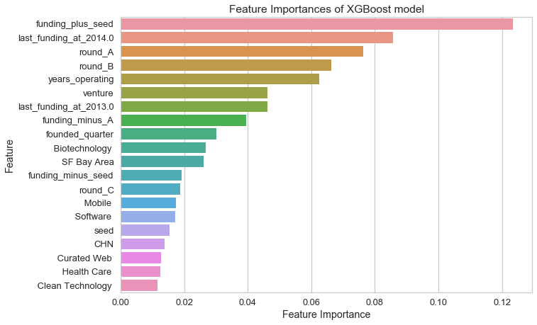


## Feature importance direction through prediction explanations!


```python
from eli5 import show_prediction
i = np.random.randint(0, X_test.shape[0])
show_prediction(f_mod, X_train_nn[i], show_feature_values=True,feature_names=X.columns.values)
```


    <style>
    table.eli5-weights tr:hover {
        filter: brightness(85%);
    }
</style>


    

    

    

    

    

    


    

    

    

    
        

    

        
            
                
                
    
        <p style="margin-bottom: 0.5em; margin-top: 0em">
            <b>
    
        y=0
    
</b>

    
    (probability <b>0.854</b>, score <b>-1.768</b>)

top features
        </p>
    
    <table class="eli5-weights"
           style="border-collapse: collapse; border: none; margin-top: 0em; table-layout: auto; margin-bottom: 2em;">
        <thead>
        <tr style="border: none;">
            
                <th style="padding: 0 1em 0 0.5em; text-align: right; border: none;" title="Feature contribution already accounts for the feature value (for linear models, contribution = weight * feature value), and the sum of feature contributions is equal to the score or, for some classifiers, to the probability. Feature values are shown if &quot;show_feature_values&quot; is True.">
                    Contribution<sup>?</sup>
                </th>
            
            <th style="padding: 0 0.5em 0 0.5em; text-align: left; border: none;">Feature</th>
            
                <th style="padding: 0 0.5em 0 1em; text-align: right; border: none;">Value</th>
            
        </tr>
        </thead>
        <tbody>
        
            <tr style="background-color: hsl(120, 100.00%, 80.00%); border: none;">
    <td style="padding: 0 1em 0 0.5em; text-align: right; border: none;">
        +0.536
    </td>
    <td style="padding: 0 0.5em 0 0.5em; text-align: left; border: none;">
        funding_plus_seed
    </td>
    
        <td style="padding: 0 0.5em 0 1em; text-align: right; border: none;">
            0.000
        </td>
    
</tr>
        
            <tr style="background-color: hsl(120, 100.00%, 85.31%); border: none;">
    <td style="padding: 0 1em 0 0.5em; text-align: right; border: none;">
        +0.344
    </td>
    <td style="padding: 0 0.5em 0 0.5em; text-align: left; border: none;">
        years_operating
    </td>
    
        <td style="padding: 0 0.5em 0 1em; text-align: right; border: none;">
            0.267
        </td>
    
</tr>
        
            <tr style="background-color: hsl(120, 100.00%, 87.80%); border: none;">
    <td style="padding: 0 1em 0 0.5em; text-align: right; border: none;">
        +0.264
    </td>
    <td style="padding: 0 0.5em 0 0.5em; text-align: left; border: none;">
        round_A
    </td>
    
        <td style="padding: 0 0.5em 0 1em; text-align: right; border: none;">
            0.000
        </td>
    
</tr>
        
            <tr style="background-color: hsl(120, 100.00%, 88.32%); border: none;">
    <td style="padding: 0 1em 0 0.5em; text-align: right; border: none;">
        +0.248
    </td>
    <td style="padding: 0 0.5em 0 0.5em; text-align: left; border: none;">
        SF<span style="background-color: hsl(120, 80%, 70%); margin: 0 0.1em 0 0.1em" title="A space symbol">&emsp;</span>Bay<span style="background-color: hsl(120, 80%, 70%); margin: 0 0.1em 0 0.1em" title="A space symbol">&emsp;</span>Area
    </td>
    
        <td style="padding: 0 0.5em 0 1em; text-align: right; border: none;">
            0.000
        </td>
    
</tr>
        
            <tr style="background-color: hsl(120, 100.00%, 88.94%); border: none;">
    <td style="padding: 0 1em 0 0.5em; text-align: right; border: none;">
        +0.230
    </td>
    <td style="padding: 0 0.5em 0 0.5em; text-align: left; border: none;">
        <span style="background-color: hsl(120, 80%, 70%); margin: 0 0.1em 0 0" title="A space symbol">&emsp;</span>Education<span style="background-color: hsl(120, 80%, 70%); margin: 0 0 0 0.1em" title="A space symbol">&emsp;</span>
    </td>
    
        <td style="padding: 0 0.5em 0 1em; text-align: right; border: none;">
            1.000
        </td>
    
</tr>
        
            <tr style="background-color: hsl(120, 100.00%, 91.49%); border: none;">
    <td style="padding: 0 1em 0 0.5em; text-align: right; border: none;">
        +0.158
    </td>
    <td style="padding: 0 0.5em 0 0.5em; text-align: left; border: none;">
        seed
    </td>
    
        <td style="padding: 0 0.5em 0 1em; text-align: right; border: none;">
            0.000
        </td>
    
</tr>
        
            <tr style="background-color: hsl(120, 100.00%, 93.11%); border: none;">
    <td style="padding: 0 1em 0 0.5em; text-align: right; border: none;">
        +0.117
    </td>
    <td style="padding: 0 0.5em 0 0.5em; text-align: left; border: none;">
        round_B
    </td>
    
        <td style="padding: 0 0.5em 0 1em; text-align: right; border: none;">
            0.000
        </td>
    
</tr>
        
            <tr style="background-color: hsl(120, 100.00%, 93.21%); border: none;">
    <td style="padding: 0 1em 0 0.5em; text-align: right; border: none;">
        +0.114
    </td>
    <td style="padding: 0 0.5em 0 0.5em; text-align: left; border: none;">
        founded_quarter
    </td>
    
        <td style="padding: 0 0.5em 0 1em; text-align: right; border: none;">
            0.000
        </td>
    
</tr>
        
            <tr style="background-color: hsl(120, 100.00%, 94.18%); border: none;">
    <td style="padding: 0 1em 0 0.5em; text-align: right; border: none;">
        +0.092
    </td>
    <td style="padding: 0 0.5em 0 0.5em; text-align: left; border: none;">
        venture
    </td>
    
        <td style="padding: 0 0.5em 0 1em; text-align: right; border: none;">
            0.000
        </td>
    
</tr>
        
            <tr style="background-color: hsl(120, 100.00%, 96.32%); border: none;">
    <td style="padding: 0 1em 0 0.5em; text-align: right; border: none;">
        +0.048
    </td>
    <td style="padding: 0 0.5em 0 0.5em; text-align: left; border: none;">
        funding_rounds
    </td>
    
        <td style="padding: 0 0.5em 0 1em; text-align: right; border: none;">
            0.000
        </td>
    
</tr>
        
            <tr style="background-color: hsl(120, 100.00%, 96.65%); border: none;">
    <td style="padding: 0 1em 0 0.5em; text-align: right; border: none;">
        +0.042
    </td>
    <td style="padding: 0 0.5em 0 0.5em; text-align: left; border: none;">
        <span style="background-color: hsl(120, 80%, 70%); margin: 0 0.1em 0 0" title="A space symbol">&emsp;</span>Curated<span style="background-color: hsl(120, 80%, 70%); margin: 0 0.1em 0 0.1em" title="A space symbol">&emsp;</span>Web<span style="background-color: hsl(120, 80%, 70%); margin: 0 0 0 0.1em" title="A space symbol">&emsp;</span>
    </td>
    
        <td style="padding: 0 0.5em 0 1em; text-align: right; border: none;">
            0.000
        </td>
    
</tr>
        
            <tr style="background-color: hsl(120, 100.00%, 96.72%); border: none;">
    <td style="padding: 0 1em 0 0.5em; text-align: right; border: none;">
        +0.041
    </td>
    <td style="padding: 0 0.5em 0 0.5em; text-align: left; border: none;">
        first_funding_at_2005.0
    </td>
    
        <td style="padding: 0 0.5em 0 1em; text-align: right; border: none;">
            0.000
        </td>
    
</tr>
        
            <tr style="background-color: hsl(120, 100.00%, 96.87%); border: none;">
    <td style="padding: 0 1em 0 0.5em; text-align: right; border: none;">
        +0.038
    </td>
    <td style="padding: 0 0.5em 0 0.5em; text-align: left; border: none;">
        last_funding_at_2012.0
    </td>
    
        <td style="padding: 0 0.5em 0 1em; text-align: right; border: none;">
            1.000
        </td>
    
</tr>
        
            <tr style="background-color: hsl(120, 100.00%, 97.08%); border: none;">
    <td style="padding: 0 1em 0 0.5em; text-align: right; border: none;">
        +0.034
    </td>
    <td style="padding: 0 0.5em 0 0.5em; text-align: left; border: none;">
        round_C
    </td>
    
        <td style="padding: 0 0.5em 0 1em; text-align: right; border: none;">
            0.000
        </td>
    
</tr>
        
            <tr style="background-color: hsl(120, 100.00%, 97.53%); border: none;">
    <td style="padding: 0 1em 0 0.5em; text-align: right; border: none;">
        +0.027
    </td>
    <td style="padding: 0 0.5em 0 0.5em; text-align: left; border: none;">
        New<span style="background-color: hsl(120, 80%, 70%); margin: 0 0.1em 0 0.1em" title="A space symbol">&emsp;</span>York<span style="background-color: hsl(120, 80%, 70%); margin: 0 0.1em 0 0.1em" title="A space symbol">&emsp;</span>City
    </td>
    
        <td style="padding: 0 0.5em 0 1em; text-align: right; border: none;">
            0.000
        </td>
    
</tr>
        
            <tr style="background-color: hsl(120, 100.00%, 97.83%); border: none;">
    <td style="padding: 0 1em 0 0.5em; text-align: right; border: none;">
        +0.022
    </td>
    <td style="padding: 0 0.5em 0 0.5em; text-align: left; border: none;">
        per_round
    </td>
    
        <td style="padding: 0 0.5em 0 1em; text-align: right; border: none;">
            0.000
        </td>
    
</tr>
        
            <tr style="background-color: hsl(120, 100.00%, 97.89%); border: none;">
    <td style="padding: 0 1em 0 0.5em; text-align: right; border: none;">
        +0.022
    </td>
    <td style="padding: 0 0.5em 0 0.5em; text-align: left; border: none;">
        last_funding_at_2011.0
    </td>
    
        <td style="padding: 0 0.5em 0 1em; text-align: right; border: none;">
            0.000
        </td>
    
</tr>
        
            <tr style="background-color: hsl(120, 100.00%, 97.91%); border: none;">
    <td style="padding: 0 1em 0 0.5em; text-align: right; border: none;">
        +0.021
    </td>
    <td style="padding: 0 0.5em 0 0.5em; text-align: left; border: none;">
        debt_financing
    </td>
    
        <td style="padding: 0 0.5em 0 1em; text-align: right; border: none;">
            0.000
        </td>
    
</tr>
        
            <tr style="background-color: hsl(120, 100.00%, 98.34%); border: none;">
    <td style="padding: 0 1em 0 0.5em; text-align: right; border: none;">
        +0.015
    </td>
    <td style="padding: 0 0.5em 0 0.5em; text-align: left; border: none;">
        last_funding_at_2006.0
    </td>
    
        <td style="padding: 0 0.5em 0 1em; text-align: right; border: none;">
            0.000
        </td>
    
</tr>
        
            <tr style="background-color: hsl(120, 100.00%, 98.80%); border: none;">
    <td style="padding: 0 1em 0 0.5em; text-align: right; border: none;">
        +0.010
    </td>
    <td style="padding: 0 0.5em 0 0.5em; text-align: left; border: none;">
        angel
    </td>
    
        <td style="padding: 0 0.5em 0 1em; text-align: right; border: none;">
            0.000
        </td>
    
</tr>
        
            <tr style="background-color: hsl(120, 100.00%, 98.94%); border: none;">
    <td style="padding: 0 1em 0 0.5em; text-align: right; border: none;">
        +0.008
    </td>
    <td style="padding: 0 0.5em 0 0.5em; text-align: left; border: none;">
        first_funding_at_2007.0
    </td>
    
        <td style="padding: 0 0.5em 0 1em; text-align: right; border: none;">
            0.000
        </td>
    
</tr>
        
            <tr style="background-color: hsl(120, 100.00%, 98.96%); border: none;">
    <td style="padding: 0 1em 0 0.5em; text-align: right; border: none;">
        +0.008
    </td>
    <td style="padding: 0 0.5em 0 0.5em; text-align: left; border: none;">
        Boston
    </td>
    
        <td style="padding: 0 0.5em 0 1em; text-align: right; border: none;">
            0.000
        </td>
    
</tr>
        
            <tr style="background-color: hsl(120, 100.00%, 99.30%); border: none;">
    <td style="padding: 0 1em 0 0.5em; text-align: right; border: none;">
        +0.004
    </td>
    <td style="padding: 0 0.5em 0 0.5em; text-align: left; border: none;">
        <span style="background-color: hsl(120, 80%, 70%); margin: 0 0.1em 0 0" title="A space symbol">&emsp;</span>Mobile<span style="background-color: hsl(120, 80%, 70%); margin: 0 0 0 0.1em" title="A space symbol">&emsp;</span>
    </td>
    
        <td style="padding: 0 0.5em 0 1em; text-align: right; border: none;">
            0.000
        </td>
    
</tr>
        
            <tr style="background-color: hsl(120, 100.00%, 99.48%); border: none;">
    <td style="padding: 0 1em 0 0.5em; text-align: right; border: none;">
        +0.003
    </td>
    <td style="padding: 0 0.5em 0 0.5em; text-align: left; border: none;">
        round_D
    </td>
    
        <td style="padding: 0 0.5em 0 1em; text-align: right; border: none;">
            0.000
        </td>
    
</tr>
        
            <tr style="background-color: hsl(120, 100.00%, 99.49%); border: none;">
    <td style="padding: 0 1em 0 0.5em; text-align: right; border: none;">
        +0.003
    </td>
    <td style="padding: 0 0.5em 0 0.5em; text-align: left; border: none;">
        Seattle
    </td>
    
        <td style="padding: 0 0.5em 0 1em; text-align: right; border: none;">
            0.000
        </td>
    
</tr>
        
            <tr style="background-color: hsl(120, 100.00%, 99.53%); border: none;">
    <td style="padding: 0 1em 0 0.5em; text-align: right; border: none;">
        +0.003
    </td>
    <td style="padding: 0 0.5em 0 0.5em; text-align: left; border: none;">
        CAN
    </td>
    
        <td style="padding: 0 0.5em 0 1em; text-align: right; border: none;">
            0.000
        </td>
    
</tr>
        
            <tr style="background-color: hsl(120, 100.00%, 99.80%); border: none;">
    <td style="padding: 0 1em 0 0.5em; text-align: right; border: none;">
        +0.001
    </td>
    <td style="padding: 0 0.5em 0 0.5em; text-align: left; border: none;">
        <span style="background-color: hsl(120, 80%, 70%); margin: 0 0.1em 0 0" title="A space symbol">&emsp;</span>Social<span style="background-color: hsl(120, 80%, 70%); margin: 0 0.1em 0 0.1em" title="A space symbol">&emsp;</span>Media<span style="background-color: hsl(120, 80%, 70%); margin: 0 0 0 0.1em" title="A space symbol">&emsp;</span>
    </td>
    
        <td style="padding: 0 0.5em 0 1em; text-align: right; border: none;">
            0.000
        </td>
    
</tr>
        
            <tr style="background-color: hsl(120, 100.00%, 99.90%); border: none;">
    <td style="padding: 0 1em 0 0.5em; text-align: right; border: none;">
        +0.000
    </td>
    <td style="padding: 0 0.5em 0 0.5em; text-align: left; border: none;">
        <span style="background-color: hsl(120, 80%, 70%); margin: 0 0.1em 0 0" title="A space symbol">&emsp;</span>Finance<span style="background-color: hsl(120, 80%, 70%); margin: 0 0 0 0.1em" title="A space symbol">&emsp;</span>
    </td>
    
        <td style="padding: 0 0.5em 0 1em; text-align: right; border: none;">
            0.000
        </td>
    
</tr>
        
            <tr style="background-color: hsl(120, 100.00%, 99.99%); border: none;">
    <td style="padding: 0 1em 0 0.5em; text-align: right; border: none;">
        +0.000
    </td>
    <td style="padding: 0 0.5em 0 0.5em; text-align: left; border: none;">
        <span style="background-color: hsl(120, 80%, 70%); margin: 0 0.1em 0 0" title="A space symbol">&emsp;</span>Games<span style="background-color: hsl(120, 80%, 70%); margin: 0 0 0 0.1em" title="A space symbol">&emsp;</span>
    </td>
    
        <td style="padding: 0 0.5em 0 1em; text-align: right; border: none;">
            0.000
        </td>
    
</tr>
        
        

        
        
            <tr style="background-color: hsl(0, 100.00%, 99.39%); border: none;">
    <td style="padding: 0 1em 0 0.5em; text-align: right; border: none;">
        -0.004
    </td>
    <td style="padding: 0 0.5em 0 0.5em; text-align: left; border: none;">
        FRA
    </td>
    
        <td style="padding: 0 0.5em 0 1em; text-align: right; border: none;">
            0.000
        </td>
    
</tr>
        
            <tr style="background-color: hsl(0, 100.00%, 99.18%); border: none;">
    <td style="padding: 0 1em 0 0.5em; text-align: right; border: none;">
        -0.006
    </td>
    <td style="padding: 0 0.5em 0 0.5em; text-align: left; border: none;">
        GBR
    </td>
    
        <td style="padding: 0 0.5em 0 1em; text-align: right; border: none;">
            0.000
        </td>
    
</tr>
        
            <tr style="background-color: hsl(0, 100.00%, 99.16%); border: none;">
    <td style="padding: 0 1em 0 0.5em; text-align: right; border: none;">
        -0.006
    </td>
    <td style="padding: 0 0.5em 0 0.5em; text-align: left; border: none;">
        <span style="background-color: hsl(0, 80%, 70%); margin: 0 0.1em 0 0" title="A space symbol">&emsp;</span>Manufacturing<span style="background-color: hsl(0, 80%, 70%); margin: 0 0 0 0.1em" title="A space symbol">&emsp;</span>
    </td>
    
        <td style="padding: 0 0.5em 0 1em; text-align: right; border: none;">
            0.000
        </td>
    
</tr>
        
            <tr style="background-color: hsl(0, 100.00%, 98.95%); border: none;">
    <td style="padding: 0 1em 0 0.5em; text-align: right; border: none;">
        -0.008
    </td>
    <td style="padding: 0 0.5em 0 0.5em; text-align: left; border: none;">
        <span style="background-color: hsl(0, 80%, 70%); margin: 0 0.1em 0 0" title="A space symbol">&emsp;</span>Health<span style="background-color: hsl(0, 80%, 70%); margin: 0 0.1em 0 0.1em" title="A space symbol">&emsp;</span>and<span style="background-color: hsl(0, 80%, 70%); margin: 0 0.1em 0 0.1em" title="A space symbol">&emsp;</span>Wellness<span style="background-color: hsl(0, 80%, 70%); margin: 0 0 0 0.1em" title="A space symbol">&emsp;</span>
    </td>
    
        <td style="padding: 0 0.5em 0 1em; text-align: right; border: none;">
            0.000
        </td>
    
</tr>
        
            <tr style="background-color: hsl(0, 100.00%, 98.84%); border: none;">
    <td style="padding: 0 1em 0 0.5em; text-align: right; border: none;">
        -0.009
    </td>
    <td style="padding: 0 0.5em 0 0.5em; text-align: left; border: none;">
        <span style="background-color: hsl(0, 80%, 70%); margin: 0 0.1em 0 0" title="A space symbol">&emsp;</span>Hardware<span style="background-color: hsl(0, 80%, 70%); margin: 0 0.1em 0 0.1em" title="A space symbol">&emsp;</span>+<span style="background-color: hsl(0, 80%, 70%); margin: 0 0.1em 0 0.1em" title="A space symbol">&emsp;</span>Software<span style="background-color: hsl(0, 80%, 70%); margin: 0 0 0 0.1em" title="A space symbol">&emsp;</span>
    </td>
    
        <td style="padding: 0 0.5em 0 1em; text-align: right; border: none;">
            0.000
        </td>
    
</tr>
        
            <tr style="background-color: hsl(0, 100.00%, 98.61%); border: none;">
    <td style="padding: 0 1em 0 0.5em; text-align: right; border: none;">
        -0.012
    </td>
    <td style="padding: 0 0.5em 0 0.5em; text-align: left; border: none;">
        <span style="background-color: hsl(0, 80%, 70%); margin: 0 0.1em 0 0" title="A space symbol">&emsp;</span>Health<span style="background-color: hsl(0, 80%, 70%); margin: 0 0.1em 0 0.1em" title="A space symbol">&emsp;</span>Care<span style="background-color: hsl(0, 80%, 70%); margin: 0 0 0 0.1em" title="A space symbol">&emsp;</span>
    </td>
    
        <td style="padding: 0 0.5em 0 1em; text-align: right; border: none;">
            0.000
        </td>
    
</tr>
        
            <tr style="background-color: hsl(0, 100.00%, 98.60%); border: none;">
    <td style="padding: 0 1em 0 0.5em; text-align: right; border: none;">
        -0.012
    </td>
    <td style="padding: 0 0.5em 0 0.5em; text-align: left; border: none;">
        <span style="background-color: hsl(0, 80%, 70%); margin: 0 0.1em 0 0" title="A space symbol">&emsp;</span>Clean<span style="background-color: hsl(0, 80%, 70%); margin: 0 0.1em 0 0.1em" title="A space symbol">&emsp;</span>Technology<span style="background-color: hsl(0, 80%, 70%); margin: 0 0 0 0.1em" title="A space symbol">&emsp;</span>
    </td>
    
        <td style="padding: 0 0.5em 0 1em; text-align: right; border: none;">
            0.000
        </td>
    
</tr>
        
            <tr style="background-color: hsl(0, 100.00%, 98.50%); border: none;">
    <td style="padding: 0 1em 0 0.5em; text-align: right; border: none;">
        -0.013
    </td>
    <td style="padding: 0 0.5em 0 0.5em; text-align: left; border: none;">
        CHN
    </td>
    
        <td style="padding: 0 0.5em 0 1em; text-align: right; border: none;">
            0.000
        </td>
    
</tr>
        
            <tr style="background-color: hsl(0, 100.00%, 97.42%); border: none;">
    <td style="padding: 0 1em 0 0.5em; text-align: right; border: none;">
        -0.029
    </td>
    <td style="padding: 0 0.5em 0 0.5em; text-align: left; border: none;">
        <span style="background-color: hsl(0, 80%, 70%); margin: 0 0.1em 0 0" title="A space symbol">&emsp;</span>Software<span style="background-color: hsl(0, 80%, 70%); margin: 0 0 0 0.1em" title="A space symbol">&emsp;</span>
    </td>
    
        <td style="padding: 0 0.5em 0 1em; text-align: right; border: none;">
            0.000
        </td>
    
</tr>
        
            <tr style="background-color: hsl(0, 100.00%, 96.77%); border: none;">
    <td style="padding: 0 1em 0 0.5em; text-align: right; border: none;">
        -0.040
    </td>
    <td style="padding: 0 0.5em 0 0.5em; text-align: left; border: none;">
        <span style="background-color: hsl(0, 80%, 70%); margin: 0 0.1em 0 0" title="A space symbol">&emsp;</span>Biotechnology<span style="background-color: hsl(0, 80%, 70%); margin: 0 0 0 0.1em" title="A space symbol">&emsp;</span>
    </td>
    
        <td style="padding: 0 0.5em 0 1em; text-align: right; border: none;">
            0.000
        </td>
    
</tr>
        
            <tr style="background-color: hsl(0, 100.00%, 93.90%); border: none;">
    <td style="padding: 0 1em 0 0.5em; text-align: right; border: none;">
        -0.098
    </td>
    <td style="padding: 0 0.5em 0 0.5em; text-align: left; border: none;">
        &lt;BIAS&gt;
    </td>
    
        <td style="padding: 0 0.5em 0 1em; text-align: right; border: none;">
            1.000
        </td>
    
</tr>
        
            <tr style="background-color: hsl(0, 100.00%, 92.26%); border: none;">
    <td style="padding: 0 1em 0 0.5em; text-align: right; border: none;">
        -0.138
    </td>
    <td style="padding: 0 0.5em 0 0.5em; text-align: left; border: none;">
        last_funding_at_2013.0
    </td>
    
        <td style="padding: 0 0.5em 0 1em; text-align: right; border: none;">
            0.000
        </td>
    
</tr>
        
            <tr style="background-color: hsl(0, 100.00%, 86.33%); border: none;">
    <td style="padding: 0 1em 0 0.5em; text-align: right; border: none;">
        -0.311
    </td>
    <td style="padding: 0 0.5em 0 0.5em; text-align: left; border: none;">
        last_funding_at_2014.0
    </td>
    
        <td style="padding: 0 0.5em 0 1em; text-align: right; border: none;">
            0.000
        </td>
    
</tr>
        

        </tbody>
    </table>

            
        

        


    

    

    

    


    

    

    

    

    

    


    

    

    

    

    

    


# Recommendations:

    For financial strategies, early funding is best, focusing on seed funding especially. The first rounds are most important for a company to get acquired. Look for venture capital to fund your business as well.

## Future work: 

    1. Clustering
    2. PCA 
    3. SHAP and more LIME 
    4. Bayesian and genetic algo hyperparameter tuning
